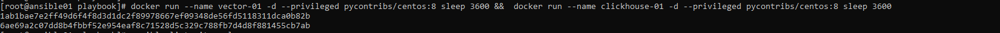
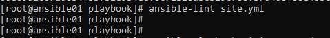
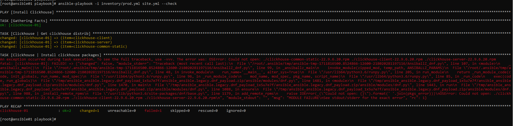

# Домашнее задание к занятию 2 «Работа с Playbook»

## Основная часть

1. Подготовьте свой inventory-файл `prod.yml`

Для тестирования использовал контейнеризированный образ Centos 8

```docker run --name vector-01 -d pycontribs/centos:8 sleep 3600 &&  docker run --name clickhouse-01 -d pycontribs/centos:8 sleep 3600```



<details>
  <summary>inventory/prod.yml</summary>

```yaml
---
clickhouse:
  hosts:
    clickhouse-01:
      ansible_connection: docker
vector:
   hosts:
     vector-01:
      ansible_connection: docker
```
</details>

`2-4. Допишите playbook......`

<details>
  <summary>site.yml</summary>

```yaml
---
- name: Install Clickhouse
  hosts: clickhouse
  handlers:
    - name: Start clickhouse service
      ansible.builtin.service:
        name: clickhouse-server
        state: restarted

  tasks:
    - block:
        - name: Clickhouse | Get clickhouse distrib
          ansible.builtin.get_url:
            url: "https://packages.clickhouse.com/rpm/stable/{{ item }}-{{ clickhouse_version }}.x86_64.rpm"
            dest: "./{{ item }}-{{ clickhouse_version }}.rpm"
          loop: "{{ clickhouse_packages }}"
      rescue:
        - name: Clickhouse | Get clickhouse distrib
          ansible.builtin.get_url:
            url: "https://packages.clickhouse.com/rpm/stable/clickhouse-common-static-{{ clickhouse_version }}.x86_64.rpm"
            dest: "./clickhouse-common-static-{{ clickhouse_version }}.rpm"

    - name: Clickhouse | Install clickhouse packages
      ansible.builtin.yum:
        name:
          - ./clickhouse-common-static-{{ clickhouse_version }}.rpm
          - ./clickhouse-client-{{ clickhouse_version }}.rpm
          - ./clickhouse-server-{{ clickhouse_version }}.rpm
        disablerepo: "*"
        disable_gpg_check: true
      notify: Start clickhouse service

    - name: Clickhouse | Flush handlers
      ansible.builtin.meta: flush_handlers

    - name: Clickhouse | Create database
      ansible.builtin.command: "clickhouse-client -q 'create database logs;'"
      register: create_db
      failed_when: create_db.rc != 0 and create_db.rc !=82
      changed_when: create_db.rc == 0

- name: Install Vector
  hosts: vector
  handlers:
    - name: Start Vector service
      become: true
      ansible.builtin.service:
        name: vector
        state: restarted
  tasks:
    - name: Vector | Create dir
      ansible.builtin.file:
        path: "{{ vector_home }}"
        state: directory
        mode: 0644
      tags: vector
    - name: Vector | Download packages
      ansible.builtin.get_url:
        url: "{{ vector_url }}"
        dest: "{{ vector_home }}/vector-{{ vector_version }}.rpm"
        validate_certs: false
    - name: Vector | Install packages
      ansible.builtin.yum:
        name: "{{ vector_home }}/vector-{{ vector_version }}.rpm"
        disable_gpg_check: true
        disablerepo: "*"
    - name: Apply vector template
      become: true
      ansible.builtin.template:
        src: vector.yml.j2
        dest: "{{ vector_config_dir }}/vector.yml"
        mode: "0644"
        owner: "{{ ansible_user_id }}"
        group: "{{ ansible_user_gid }}"
        validate: vector validate --no-environment --config-yaml %s
    - name: Change vector systemd unit
      become: true
      ansible.builtin.template:
        src: vector.service.j2
        dest: /usr/lib/systemd/system/vector.service
        mode: "0644"
        owner: "{{ ansible_user_id }}"
        group: "{{ ansible_user_gid }}"
        backup: true
      notify: Start Vector service
```  
</details>

<details>
  <summary>group_vars/clickhouse/vars.yml</summary>

```yaml
---
clickhouse_version: "22.9.6.20"
clickhouse_packages:
  - clickhouse-client
  - clickhouse-server
  - clickhouse-common-static

```
</details>

<details>
  <summary>group_vars/vector/vars.yml</summary>

```yaml
---
vector_url: "https://packages.timber.io/vector/{{ vector_version }}/vector-{{ vector_version }}-1.x86_64.rpm"
vector_version: 0.25.2
vector_home: "/tmp/vector"
vector_config_dir: "/etc/vector"
```
</details>

<details>
  <summary>templates/vector.service.j2</summary>

```bash
[Unit]
Description=Vector
Documentation=https://vector.dev
After=network-online.target
Requires=network-online.target

[Service]
User={{ ansible_user_id }}
Group={{ ansible_user_id }}
ExecStart=/usr/bin/vector --config {{ vector_config_dir }}/vector.yml
ExecReload=/bin/kill -HUP $MAINPID
Restart=always
[Install]
WantedBy=multi-user.target
```
</details>

<details>
  <summary>templates/vector.yml.j2</summary>

```yaml
---
  sources:
    demo_logs:
      type: demo_logs
      format: syslog
  sinks:
    to_clickhouse:
      type: clickhouse
      inputs:
        - demo_logs
      database: logs
      endpoint: demo
      table: vector_table
      compression: gzip
      healthcheck: true
      skip_unknown_fields: true
```
</details>


5. Запустите `ansible-lint site.yml` и исправьте ошибки, если они есть.

Ошибок нет



6. Попробуйте запустить playbook на этом окружении с флагом `--check`.



Ошибка связана с тем, что на хосте clickhouse-01 локально отсутствую  пакеты для установки. В случае запуска playbook с ключом  check,  никакие действия на managed нодах  не выполняются и task "Clickhouse | Get clickhouse distrib"  по факту пакеты не скачивает

7. Запустите playbook на `prod.yml` окружении с флагом `--diff`. Убедитесь, что изменения на системе произведены.

<details>
  <summary>вывод  консоли</summary>

```bash
[root@ansible01 playbook]# ansible-playbook -i inventory/prod.yml site.yml --diff

PLAY [Install Clickhouse] *******************************************************************************************************************************************************************************************************************
TASK [Gathering Facts] **********************************************************************************************************************************************************************************************************************ok: [clickhouse-01]

TASK [Clickhouse | Get clickhouse distrib] **************************************************************************************************************************************************************************************************changed: [clickhouse-01] => (item=clickhouse-client)
changed: [clickhouse-01] => (item=clickhouse-server)
changed: [clickhouse-01] => (item=clickhouse-common-static)

TASK [Clickhouse | Install clickhouse packages] *********************************************************************************************************************************************************************************************changed: [clickhouse-01]

TASK [Clickhouse | Flush handlers] **********************************************************************************************************************************************************************************************************
RUNNING HANDLER [Start clickhouse service] **************************************************************************************************************************************************************************************************changed: [clickhouse-01]

TASK [Clickhouse | Create database] *********************************************************************************************************************************************************************************************************changed: [clickhouse-01]

PLAY [Install Vector] ***********************************************************************************************************************************************************************************************************************
TASK [Gathering Facts] **********************************************************************************************************************************************************************************************************************ok: [vector-01]

TASK [Vector | Create dir] ******************************************************************************************************************************************************************************************************************--- before
+++ after
@@ -1,5 +1,5 @@
 {
-    "mode": "0755",
+    "mode": "0644",
     "path": "/tmp/vector",
-    "state": "absent"
+    "state": "directory"
 }

changed: [vector-01]

TASK [Vector | Download packages] ***********************************************************************************************************************************************************************************************************changed: [vector-01]

TASK [Vector | Install packages] ************************************************************************************************************************************************************************************************************changed: [vector-01]

TASK [Apply vector template] ****************************************************************************************************************************************************************************************************************--- before
+++ after: /root/.ansible/tmp/ansible-local-12782dznlk6qg/tmpwndk6upq/vector.yml.j2
@@ -0,0 +1,16 @@
+---
+  sources:
+    demo_logs:
+      type: demo_logs
+      format: syslog
+  sinks:
+    to_clickhouse:
+      type: clickhouse
+      inputs:
+        - demo_logs
+      database: logs
+      endpoint: demo
+      table: vector_table
+      compression: gzip
+      healthcheck: true
+      skip_unknown_fields: true

changed: [vector-01]

RUNNING HANDLER [Start Vector service] ******************************************************************************************************************************************************************************************************fatal: [vector-01]: FAILED! => {"changed": false, "msg": "Could not find the requested service vector: host"}

PLAY RECAP **********************************************************************************************************************************************************************************************************************************clickhouse-01              : ok=5    changed=4    unreachable=0    failed=0    skipped=0    rescued=0    ignored=0
vector-01                  : ok=5    changed=4    unreachable=0    failed=1    skipped=0    rescued=0    ignored=0

```
</details>

Ошибка запуска handler для перезапуска vector связана с тем,  что  в качестве хостов  inventory  используются контейнеры докер и у них  отстутствует systemd (могу ошибаться)  

8. Повторно запустите playbook с флагом `--diff` и убедитесь, что playbook идемпотентен.


9. Подготовьте README.md-файл по своему playbook. В нём должно быть описано: что делает playbook, какие у него есть параметры и теги. Пример качественной документации ansible playbook по [ссылке](https://github.com/opensearch-project/ansible-playbook). Так же приложите скриншоты выполнения заданий №5-8
10. Готовый playbook выложите в свой репозиторий, поставьте тег `08-ansible-02-playbook` на фиксирующий коммит, в ответ предоставьте ссылку на него.

---

### Как оформить решение задания

Выполненное домашнее задание пришлите в виде ссылки на .md-файл в вашем репозитории.

---
