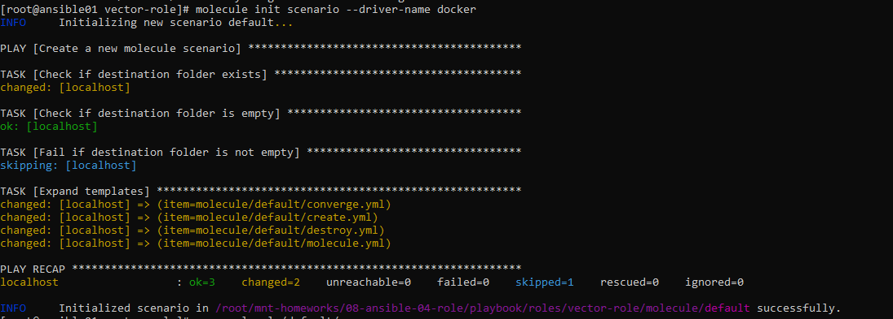

# Домашнее задание к занятию 5 «Тестирование roles»

## Подготовка к выполнению

1. Установите molecule и его драйвера: `pip3 install "molecule molecule_docker molecule_podman`.
2. Выполните `docker pull aragast/netology:latest` —  это образ с podman, tox и несколькими пайтонами (3.7 и 3.9) внутри.

## Основная часть

Ваша цель — настроить тестирование ваших ролей. 

Задача — сделать сценарии тестирования для vector. 

Ожидаемый результат — все сценарии успешно проходят тестирование ролей.

### Molecule

1. Запустите  `molecule test -s ubuntu_xenial` (или с любым другим сценарием, не имеет значения) внутри корневой директории clickhouse-role, посмотрите на вывод команды. Данная команда может отработать с ошибками или не отработать вовсе, это нормально. Наша цель - посмотреть как другие в реальном мире используют молекулу И из чего может состоять сценарий тестирования.
2. Перейдите в каталог с ролью vector-role и создайте сценарий тестирования по умолчанию при помощи `molecule init scenario --driver-name docker`.



3. Добавьте несколько разных дистрибутивов (oraclelinux:8, ubuntu:latest) для инстансов и протестируйте роль, исправьте найденные ошибки, если они есть.

<details>
  <summary>molecule.yml</summary>

```bash
---
dependency:
  name: galaxy
driver:
  name: docker
lint: |
  ansible-lint .
  yamllint .
platforms:
  - name: centos7
    image: docker.io/pycontribs/centos:7
    pre_build_image: true
  - name: ubuntu
    image: docker.io/pycontribs/ubuntu:latest
    pre_build_image: true
  - name: oraclelinux
    image: docker.io/oraclelinux:8
    pre_build_image: true
provisioner:
  name: ansible
verifier:
  name: ansible
  enabled: True
role_name_check: 1
```
</details>

Запуск тестирования
<details>
  <summary>molecule test</summary>

```bash
[root@ansible01 vector-role]# molecule test --destroy=never
WARNING  Driver docker does not provide a schema.
INFO     default scenario test matrix: dependency, cleanup, destroy, syntax, create, prepare, converge, idempotence, side_effect, verify, cleanup, destroy
INFO     Performing prerun with role_name_check=1...
INFO     Running default > dependency
WARNING  Skipping, missing the requirements file.
WARNING  Skipping, missing the requirements file.
INFO     Running default > cleanup
WARNING  Skipping, cleanup playbook not configured.
INFO     Running default > destroy
WARNING  Skipping, '--destroy=never' requested.
INFO     Running default > syntax
INFO     Sanity checks: 'docker'

playbook: /root/mnt-homeworks/08-ansible-04-role/playbook/roles/vector-role/molecule/default/converge.yml
INFO     Running default > create

PLAY [Create] ******************************************************************

TASK [Set async_dir for HOME env] **********************************************
ok: [localhost]

TASK [Log into a Docker registry] **********************************************
skipping: [localhost] => (item=None)
skipping: [localhost] => (item=None)
skipping: [localhost] => (item=None)
skipping: [localhost]

TASK [Check presence of custom Dockerfiles] ************************************
ok: [localhost] => (item={'image': 'docker.io/pycontribs/centos:7', 'name': 'centos7', 'pre_build_image': True})
ok: [localhost] => (item={'image': 'docker.io/pycontribs/ubuntu:latest', 'name': 'ubuntu', 'pre_build_image': True})
ok: [localhost] => (item={'image': 'docker.io/oraclelinux:8', 'name': 'oraclelinux', 'pre_build_image': True})

TASK [Create Dockerfiles from image names] *************************************
skipping: [localhost] => (item={'image': 'docker.io/pycontribs/centos:7', 'name': 'centos7', 'pre_build_image': True})
skipping: [localhost] => (item={'image': 'docker.io/pycontribs/ubuntu:latest', 'name': 'ubuntu', 'pre_build_image': True})
skipping: [localhost] => (item={'image': 'docker.io/oraclelinux:8', 'name': 'oraclelinux', 'pre_build_image': True})
skipping: [localhost]

TASK [Synchronization the context] *********************************************
skipping: [localhost] => (item={'image': 'docker.io/pycontribs/centos:7', 'name': 'centos7', 'pre_build_image': True})
skipping: [localhost] => (item={'image': 'docker.io/pycontribs/ubuntu:latest', 'name': 'ubuntu', 'pre_build_image': True})
skipping: [localhost] => (item={'image': 'docker.io/oraclelinux:8', 'name': 'oraclelinux', 'pre_build_image': True})
skipping: [localhost]

TASK [Discover local Docker images] ********************************************
ok: [localhost] => (item={'changed': False, 'skipped': True, 'skip_reason': 'Conditional result was False', 'false_condition': 'not item.pre_build_image | default(false)', 'item': {'image': 'docker.io/pycontribs/centos:7', 'name': 'centos7', 'pre_build_image': True}, 'ansible_loop_var': 'item', 'i': 0, 'ansible_index_var': 'i'})
ok: [localhost] => (item={'changed': False, 'skipped': True, 'skip_reason': 'Conditional result was False', 'false_condition': 'not item.pre_build_image | default(false)', 'item': {'image': 'docker.io/pycontribs/ubuntu:latest', 'name': 'ubuntu', 'pre_build_image': True}, 'ansible_loop_var': 'item', 'i': 1, 'ansible_index_var': 'i'})
ok: [localhost] => (item={'changed': False, 'skipped': True, 'skip_reason': 'Conditional result was False', 'false_condition': 'not item.pre_build_image | default(false)', 'item': {'image': 'docker.io/oraclelinux:8', 'name': 'oraclelinux', 'pre_build_image': True}, 'ansible_loop_var': 'item', 'i': 2, 'ansible_index_var': 'i'})

TASK [Build an Ansible compatible image (new)] *********************************
skipping: [localhost] => (item=molecule_local/docker.io/pycontribs/centos:7)
skipping: [localhost] => (item=molecule_local/docker.io/pycontribs/ubuntu:latest)
skipping: [localhost] => (item=molecule_local/docker.io/oraclelinux:8)
skipping: [localhost]

TASK [Create docker network(s)] ************************************************
skipping: [localhost]

TASK [Determine the CMD directives] ********************************************
ok: [localhost] => (item={'image': 'docker.io/pycontribs/centos:7', 'name': 'centos7', 'pre_build_image': True})
ok: [localhost] => (item={'image': 'docker.io/pycontribs/ubuntu:latest', 'name': 'ubuntu', 'pre_build_image': True})
ok: [localhost] => (item={'image': 'docker.io/oraclelinux:8', 'name': 'oraclelinux', 'pre_build_image': True})

TASK [Create molecule instance(s)] *********************************************
changed: [localhost] => (item=centos7)
changed: [localhost] => (item=ubuntu)
changed: [localhost] => (item=oraclelinux)

TASK [Wait for instance(s) creation to complete] *******************************
ok: [localhost] => (item={'failed': 0, 'started': 1, 'finished': 0, 'ansible_job_id': 'j771755846344.4507', 'results_file': '/root/.ansible_async/j771755846344.4507', 'changed': True, 'item': {'image': 'docker.io/pycontribs/centos:7', 'name': 'centos7', 'pre_build_image': True}, 'ansible_loop_var': 'item'})
ok: [localhost] => (item={'failed': 0, 'started': 1, 'finished': 0, 'ansible_job_id': 'j154363649494.4532', 'results_file': '/root/.ansible_async/j154363649494.4532', 'changed': True, 'item': {'image': 'docker.io/pycontribs/ubuntu:latest', 'name': 'ubuntu', 'pre_build_image': True}, 'ansible_loop_var': 'item'})
ok: [localhost] => (item={'failed': 0, 'started': 1, 'finished': 0, 'ansible_job_id': 'j556888759507.4564', 'results_file': '/root/.ansible_async/j556888759507.4564', 'changed': True, 'item': {'image': 'docker.io/oraclelinux:8', 'name': 'oraclelinux', 'pre_build_image': True}, 'ansible_loop_var': 'item'})

PLAY RECAP *********************************************************************
localhost                  : ok=6    changed=1    unreachable=0    failed=0    skipped=5    rescued=0    ignored=0

INFO     Running default > prepare
WARNING  Skipping, prepare playbook not configured.
INFO     Running default > converge

PLAY [Converge] ****************************************************************

TASK [Gathering Facts] *********************************************************
ok: [oraclelinux]
ok: [ubuntu]
ok: [centos7]

TASK [Include dir vector role] *************************************************

TASK [vector-role : Get vector distrib rpm] ************************************
skipping: [oraclelinux]
skipping: [ubuntu]
ok: [centos7]

TASK [vector-role : Install vector rpm packages] *******************************
skipping: [oraclelinux]
skipping: [ubuntu]
ok: [centos7]

TASK [vector-role : Get vector distrib deb] ************************************
skipping: [oraclelinux]
skipping: [centos7]
ok: [ubuntu]

TASK [vector-role : Install vector deb packages] *******************************
skipping: [centos7]
skipping: [oraclelinux]
ok: [ubuntu]

TASK [vector-role : Get vector distrib rpm based for dnf packet manager] *******
skipping: [centos7]
skipping: [ubuntu]
ok: [oraclelinux]

TASK [vector-role : Install vector packages (dnf packet manager)] **************
skipping: [centos7]
skipping: [ubuntu]
ok: [oraclelinux]

TASK [vector-role : Generate vector config] ************************************
ok: [ubuntu]
ok: [centos7]
ok: [oraclelinux]

PLAY RECAP *********************************************************************
centos7                    : ok=4    changed=0    unreachable=0    failed=0    skipped=4    rescued=0    ignored=0
oraclelinux                : ok=4    changed=0    unreachable=0    failed=0    skipped=4    rescued=0    ignored=0
ubuntu                     : ok=4    changed=0    unreachable=0    failed=0    skipped=4    rescued=0    ignored=0

INFO     Running default > idempotence

PLAY [Converge] ****************************************************************

TASK [Gathering Facts] *********************************************************
ok: [ubuntu]
ok: [oraclelinux]
ok: [centos7]

TASK [Include dir vector role] *************************************************

TASK [vector-role : Get vector distrib rpm] ************************************
skipping: [oraclelinux]
skipping: [ubuntu]
ok: [centos7]

TASK [vector-role : Install vector rpm packages] *******************************
skipping: [ubuntu]
skipping: [oraclelinux]
ok: [centos7]

TASK [vector-role : Get vector distrib deb] ************************************
skipping: [centos7]
skipping: [oraclelinux]
ok: [ubuntu]

TASK [vector-role : Install vector deb packages] *******************************
skipping: [centos7]
skipping: [oraclelinux]
ok: [ubuntu]

TASK [vector-role : Get vector distrib rpm based for dnf packet manager] *******
skipping: [centos7]
skipping: [ubuntu]
ok: [oraclelinux]

TASK [vector-role : Install vector packages (dnf packet manager)] **************
skipping: [centos7]
skipping: [ubuntu]
ok: [oraclelinux]

TASK [vector-role : Generate vector config] ************************************
ok: [oraclelinux]
ok: [ubuntu]
ok: [centos7]

PLAY RECAP *********************************************************************
centos7                    : ok=4    changed=0    unreachable=0    failed=0    skipped=4    rescued=0    ignored=0
oraclelinux                : ok=4    changed=0    unreachable=0    failed=0    skipped=4    rescued=0    ignored=0
ubuntu                     : ok=4    changed=0    unreachable=0    failed=0    skipped=4    rescued=0    ignored=0

```
</details>

4. Добавьте несколько assert в verify.yml-файл для  проверки работоспособности vector-role (проверка, что конфиг валидный, проверка успешности запуска и др.).

<details>
  <summary>verify.yml</summary>

```bash
- name: Verify
  hosts: all
  gather_facts: false
  tasks:
  - name: Get Vector version
    command: vector --version
    register: vector_version_output
  - name: Read Vector config file
    slurp:
      src: "/etc/vector/vector.yaml"
    register: vector_config
  - name: Check Version
    ansible.builtin.assert:
      that:
        - vector_version_output.stdout == "vector 0.35.0 (x86_64-unknown-linux-gnu e57c0c0 2024-01-08 14:42:10.10390$      success_msg : "its all ok"
      fail_msg: "wrong version"
  - name: Check endpoin in vector.yaml
    ansible.builtin.assert:
      that:
        - "'endpoint' in vector_config['content'] | b64decode | string"
      success_msg : "its all ok"
      fail_msg: "nginxdb not found"
```
</details>

<details>
  <summary>Запуск с файлом verify.yml</summary>

```bash
[root@ansible01 vector-role]# molecule test --destroy=never
WARNING  Driver docker does not provide a schema.
INFO     default scenario test matrix: dependency, cleanup, destroy, syntax, create, prepare, converge, idempotence, side_effect, verify, cleanup, destroy
INFO     Performing prerun with role_name_check=1...
INFO     Running default > dependency
WARNING  Skipping, missing the requirements file.
WARNING  Skipping, missing the requirements file.
INFO     Running default > cleanup
WARNING  Skipping, cleanup playbook not configured.
INFO     Running default > destroy
WARNING  Skipping, '--destroy=never' requested.
INFO     Running default > syntax
INFO     Sanity checks: 'docker'

playbook: /root/mnt-homeworks/08-ansible-04-role/playbook/roles/vector-role/molecule/default/converge.yml
INFO     Running default > create

PLAY [Create] ******************************************************************

TASK [Set async_dir for HOME env] **********************************************
ok: [localhost]

TASK [Log into a Docker registry] **********************************************
skipping: [localhost] => (item=None)
skipping: [localhost] => (item=None)
skipping: [localhost] => (item=None)
skipping: [localhost]

TASK [Check presence of custom Dockerfiles] ************************************
ok: [localhost] => (item={'image': 'docker.io/pycontribs/centos:7', 'name': 'centos7', 'pre_build_image': True})
ok: [localhost] => (item={'image': 'docker.io/pycontribs/ubuntu:latest', 'name': 'ubuntu', 'pre_build_image': True})
ok: [localhost] => (item={'image': 'docker.io/oraclelinux:8', 'name': 'oraclelinux', 'pre_build_image': True})

TASK [Create Dockerfiles from image names] *************************************
skipping: [localhost] => (item={'image': 'docker.io/pycontribs/centos:7', 'name': 'centos7', 'pre_build_image': True})
skipping: [localhost] => (item={'image': 'docker.io/pycontribs/ubuntu:latest', 'name': 'ubuntu', 'pre_build_image': True})
skipping: [localhost] => (item={'image': 'docker.io/oraclelinux:8', 'name': 'oraclelinux', 'pre_build_image': True})
skipping: [localhost]

TASK [Synchronization the context] *********************************************
skipping: [localhost] => (item={'image': 'docker.io/pycontribs/centos:7', 'name': 'centos7', 'pre_build_image': True})
skipping: [localhost] => (item={'image': 'docker.io/pycontribs/ubuntu:latest', 'name': 'ubuntu', 'pre_build_image': True})
skipping: [localhost] => (item={'image': 'docker.io/oraclelinux:8', 'name': 'oraclelinux', 'pre_build_image': True})
skipping: [localhost]

TASK [Discover local Docker images] ********************************************
ok: [localhost] => (item={'changed': False, 'skipped': True, 'skip_reason': 'Conditional result was False', 'false_condition': 'not item.pre_build_image | default(false)', 'item': {'image': 'docker.io/pycontribs/centos:7', 'name': 'centos7', 'pre_build_image': True}, 'ansible_loop_var': 'item', 'i': 0, 'ansible_index_var': 'i'})
ok: [localhost] => (item={'changed': False, 'skipped': True, 'skip_reason': 'Conditional result was False', 'false_condition': 'not item.pre_build_image | default(false)', 'item': {'image': 'docker.io/pycontribs/ubuntu:latest', 'name': 'ubuntu', 'pre_build_image': True}, 'ansible_loop_var': 'item', 'i': 1, 'ansible_index_var': 'i'})
ok: [localhost] => (item={'changed': False, 'skipped': True, 'skip_reason': 'Conditional result was False', 'false_condition': 'not item.pre_build_image | default(false)', 'item': {'image': 'docker.io/oraclelinux:8', 'name': 'oraclelinux', 'pre_build_image': True}, 'ansible_loop_var': 'item', 'i': 2, 'ansible_index_var': 'i'})

TASK [Build an Ansible compatible image (new)] *********************************
skipping: [localhost] => (item=molecule_local/docker.io/pycontribs/centos:7)
skipping: [localhost] => (item=molecule_local/docker.io/pycontribs/ubuntu:latest)
skipping: [localhost] => (item=molecule_local/docker.io/oraclelinux:8)
skipping: [localhost]

TASK [Create docker network(s)] ************************************************
skipping: [localhost]

TASK [Determine the CMD directives] ********************************************
ok: [localhost] => (item={'image': 'docker.io/pycontribs/centos:7', 'name': 'centos7', 'pre_build_image': True})
ok: [localhost] => (item={'image': 'docker.io/pycontribs/ubuntu:latest', 'name': 'ubuntu', 'pre_build_image': True})
ok: [localhost] => (item={'image': 'docker.io/oraclelinux:8', 'name': 'oraclelinux', 'pre_build_image': True})

TASK [Create molecule instance(s)] *********************************************
changed: [localhost] => (item=centos7)
changed: [localhost] => (item=ubuntu)
changed: [localhost] => (item=oraclelinux)

TASK [Wait for instance(s) creation to complete] *******************************
ok: [localhost] => (item={'failed': 0, 'started': 1, 'finished': 0, 'ansible_job_id': 'j205001190521.9401', 'results_file': '/root/.ansible_async/j205001190521.9401', 'changed': True, 'item': {'image': 'docker.io/pycontribs/centos:7', 'name': 'centos7', 'pre_build_image': True}, 'ansible_loop_var': 'item'})
ok: [localhost] => (item={'failed': 0, 'started': 1, 'finished': 0, 'ansible_job_id': 'j612476286228.9425', 'results_file': '/root/.ansible_async/j612476286228.9425', 'changed': True, 'item': {'image': 'docker.io/pycontribs/ubuntu:latest', 'name': 'ubuntu', 'pre_build_image': True}, 'ansible_loop_var': 'item'})
ok: [localhost] => (item={'failed': 0, 'started': 1, 'finished': 0, 'ansible_job_id': 'j391989112079.9456', 'results_file': '/root/.ansible_async/j391989112079.9456', 'changed': True, 'item': {'image': 'docker.io/oraclelinux:8', 'name': 'oraclelinux', 'pre_build_image': True}, 'ansible_loop_var': 'item'})

PLAY RECAP *********************************************************************
localhost                  : ok=6    changed=1    unreachable=0    failed=0    skipped=5    rescued=0    ignored=0

INFO     Running default > prepare
WARNING  Skipping, prepare playbook not configured.
INFO     Running default > converge

PLAY [Converge] ****************************************************************

TASK [Gathering Facts] *********************************************************
ok: [ubuntu]
ok: [oraclelinux]
ok: [centos7]

TASK [Include dir vector role] *************************************************

TASK [vector-role : Get vector distrib rpm] ************************************
skipping: [oraclelinux]
skipping: [ubuntu]
ok: [centos7]

TASK [vector-role : Install vector rpm packages] *******************************
skipping: [ubuntu]
skipping: [oraclelinux]
ok: [centos7]

TASK [vector-role : Get vector distrib deb] ************************************
skipping: [oraclelinux]
skipping: [centos7]
ok: [ubuntu]

TASK [vector-role : Install vector deb packages] *******************************
skipping: [centos7]
skipping: [oraclelinux]
ok: [ubuntu]

TASK [vector-role : Get vector distrib rpm based for dnf packet manager] *******
skipping: [centos7]
skipping: [ubuntu]
ok: [oraclelinux]

TASK [vector-role : Install vector packages (dnf packet manager)] **************
skipping: [centos7]
skipping: [ubuntu]
ok: [oraclelinux]

TASK [vector-role : Generate vector config] ************************************
ok: [oraclelinux]
ok: [centos7]
ok: [ubuntu]

PLAY RECAP *********************************************************************
centos7                    : ok=4    changed=0    unreachable=0    failed=0    skipped=4    rescued=0    ignored=0
oraclelinux                : ok=4    changed=0    unreachable=0    failed=0    skipped=4    rescued=0    ignored=0
ubuntu                     : ok=4    changed=0    unreachable=0    failed=0    skipped=4    rescued=0    ignored=0

INFO     Running default > idempotence

PLAY [Converge] ****************************************************************

TASK [Gathering Facts] *********************************************************
ok: [ubuntu]
ok: [oraclelinux]
ok: [centos7]

TASK [Include dir vector role] *************************************************

TASK [vector-role : Get vector distrib rpm] ************************************
skipping: [ubuntu]
skipping: [oraclelinux]
ok: [centos7]

TASK [vector-role : Install vector rpm packages] *******************************
skipping: [oraclelinux]
skipping: [ubuntu]
ok: [centos7]

TASK [vector-role : Get vector distrib deb] ************************************
skipping: [centos7]
skipping: [oraclelinux]
ok: [ubuntu]

TASK [vector-role : Install vector deb packages] *******************************
skipping: [centos7]
skipping: [oraclelinux]
ok: [ubuntu]

TASK [vector-role : Get vector distrib rpm based for dnf packet manager] *******
skipping: [centos7]
skipping: [ubuntu]
ok: [oraclelinux]

TASK [vector-role : Install vector packages (dnf packet manager)] **************
skipping: [centos7]
skipping: [ubuntu]
ok: [oraclelinux]

TASK [vector-role : Generate vector config] ************************************
ok: [centos7]
ok: [ubuntu]
ok: [oraclelinux]

PLAY RECAP *********************************************************************
centos7                    : ok=4    changed=0    unreachable=0    failed=0    skipped=4    rescued=0    ignored=0
oraclelinux                : ok=4    changed=0    unreachable=0    failed=0    skipped=4    rescued=0    ignored=0
ubuntu                     : ok=4    changed=0    unreachable=0    failed=0    skipped=4    rescued=0    ignored=0

INFO     Idempotence completed successfully.
INFO     Running default > side_effect
WARNING  Skipping, side effect playbook not configured.
INFO     Running default > verify
INFO     Running Ansible Verifier

PLAY [Verify] ******************************************************************

TASK [Get Vector version] ******************************************************
changed: [ubuntu]
changed: [oraclelinux]
changed: [centos7]

TASK [Read Vector config file] *************************************************
ok: [centos7]
ok: [ubuntu]
ok: [oraclelinux]

TASK [Check Version] ***********************************************************
ok: [centos7] => {
    "changed": false,
    "msg": "All assertions passed"
}
ok: [oraclelinux] => {
    "changed": false,
    "msg": "All assertions passed"
}
ok: [ubuntu] => {
    "changed": false,
    "msg": "All assertions passed"
}

TASK [Check endpoin in vector.yaml] ********************************************
ok: [centos7] => {
    "changed": false,
    "msg": "its all ok"
}
ok: [oraclelinux] => {
    "changed": false,
    "msg": "its all ok"
}
ok: [ubuntu] => {
    "changed": false,
    "msg": "its all ok"
}

PLAY RECAP *********************************************************************
centos7                    : ok=4    changed=1    unreachable=0    failed=0    skipped=0    rescued=0    ignored=0
oraclelinux                : ok=4    changed=1    unreachable=0    failed=0    skipped=0    rescued=0    ignored=0
ubuntu                     : ok=4    changed=1    unreachable=0    failed=0    skipped=0    rescued=0    ignored=0

INFO     Verifier completed successfully.
INFO     Running default > cleanup
WARNING  Skipping, cleanup playbook not configured.
INFO     Running default > destroy
WARNING  Skipping, '--destroy=never' requested.
```
</details>


5. Запустите тестирование роли повторно и проверьте, что оно прошло успешно.

<details>
  <summary>Повторный запуск</summary>

```bash
[root@ansible01 vector-role]# molecule test --destroy=never
WARNING  Driver docker does not provide a schema.
INFO     default scenario test matrix: dependency, cleanup, destroy, syntax, create, prepare, converge, idempotence, side_effect, verify, cleanup, destroy
INFO     Performing prerun with role_name_check=1...
INFO     Running default > dependency
WARNING  Skipping, missing the requirements file.
WARNING  Skipping, missing the requirements file.
INFO     Running default > cleanup
WARNING  Skipping, cleanup playbook not configured.
INFO     Running default > destroy
WARNING  Skipping, '--destroy=never' requested.
INFO     Running default > syntax
INFO     Sanity checks: 'docker'

playbook: /root/mnt-homeworks/08-ansible-04-role/playbook/roles/vector-role/molecule/default/converge.yml
INFO     Running default > create
WARNING  Skipping, instances already created.
INFO     Running default > prepare
WARNING  Skipping, prepare playbook not configured.
INFO     Running default > converge

PLAY [Converge] ****************************************************************

TASK [Gathering Facts] *********************************************************
ok: [oraclelinux]
ok: [ubuntu]
ok: [centos7]

TASK [Include dir vector role] *************************************************

TASK [vector-role : Get vector distrib rpm] ************************************
skipping: [ubuntu]
skipping: [oraclelinux]
ok: [centos7]

TASK [vector-role : Install vector rpm packages] *******************************
skipping: [oraclelinux]
skipping: [ubuntu]
ok: [centos7]

TASK [vector-role : Get vector distrib deb] ************************************
skipping: [centos7]
skipping: [oraclelinux]
ok: [ubuntu]

TASK [vector-role : Install vector deb packages] *******************************
skipping: [centos7]
skipping: [oraclelinux]
ok: [ubuntu]

TASK [vector-role : Get vector distrib rpm based for dnf packet manager] *******
skipping: [centos7]
skipping: [ubuntu]
ok: [oraclelinux]

TASK [vector-role : Install vector packages (dnf packet manager)] **************
skipping: [centos7]
skipping: [ubuntu]
ok: [oraclelinux]

TASK [vector-role : Generate vector config] ************************************
ok: [centos7]
ok: [ubuntu]
ok: [oraclelinux]

PLAY RECAP *********************************************************************
centos7                    : ok=4    changed=0    unreachable=0    failed=0    skipped=4    rescued=0    ignored=0
oraclelinux                : ok=4    changed=0    unreachable=0    failed=0    skipped=4    rescued=0    ignored=0
ubuntu                     : ok=4    changed=0    unreachable=0    failed=0    skipped=4    rescued=0    ignored=0

INFO     Running default > idempotence

PLAY [Converge] ****************************************************************

TASK [Gathering Facts] *********************************************************
ok: [ubuntu]
ok: [oraclelinux]
ok: [centos7]

TASK [Include dir vector role] *************************************************

TASK [vector-role : Get vector distrib rpm] ************************************
skipping: [oraclelinux]
skipping: [ubuntu]
ok: [centos7]

TASK [vector-role : Install vector rpm packages] *******************************
skipping: [ubuntu]
skipping: [oraclelinux]
ok: [centos7]

TASK [vector-role : Get vector distrib deb] ************************************
skipping: [centos7]
skipping: [oraclelinux]
ok: [ubuntu]

TASK [vector-role : Install vector deb packages] *******************************
skipping: [centos7]
skipping: [oraclelinux]
ok: [ubuntu]

TASK [vector-role : Get vector distrib rpm based for dnf packet manager] *******
skipping: [centos7]
skipping: [ubuntu]
ok: [oraclelinux]

TASK [vector-role : Install vector packages (dnf packet manager)] **************
skipping: [centos7]
skipping: [ubuntu]
ok: [oraclelinux]

TASK [vector-role : Generate vector config] ************************************
ok: [centos7]
ok: [oraclelinux]
ok: [ubuntu]

PLAY RECAP *********************************************************************
centos7                    : ok=4    changed=0    unreachable=0    failed=0    skipped=4    rescued=0    ignored=0
oraclelinux                : ok=4    changed=0    unreachable=0    failed=0    skipped=4    rescued=0    ignored=0
ubuntu                     : ok=4    changed=0    unreachable=0    failed=0    skipped=4    rescued=0    ignored=0

INFO     Idempotence completed successfully.
INFO     Running default > side_effect
WARNING  Skipping, side effect playbook not configured.
INFO     Running default > verify
INFO     Running Ansible Verifier

PLAY [Verify] ******************************************************************

TASK [Get Vector version] ******************************************************
changed: [oraclelinux]
changed: [ubuntu]
changed: [centos7]

TASK [Read Vector config file] *************************************************
ok: [centos7]
ok: [oraclelinux]
ok: [ubuntu]

TASK [Check Version] ***********************************************************
ok: [centos7] => {
    "changed": false,
    "msg": "All assertions passed"
}
ok: [ubuntu] => {
    "changed": false,
    "msg": "All assertions passed"
}
ok: [oraclelinux] => {
    "changed": false,
    "msg": "All assertions passed"
}

TASK [Check endpoin in vector.yaml] ********************************************
ok: [ubuntu] => {
    "changed": false,
    "msg": "its all ok"
}
ok: [centos7] => {
    "changed": false,
    "msg": "its all ok"
}
ok: [oraclelinux] => {
    "changed": false,
    "msg": "its all ok"
}

PLAY RECAP *********************************************************************
centos7                    : ok=4    changed=1    unreachable=0    failed=0    skipped=0    rescued=0    ignored=0
oraclelinux                : ok=4    changed=1    unreachable=0    failed=0    skipped=0    rescued=0    ignored=0
ubuntu                     : ok=4    changed=1    unreachable=0    failed=0    skipped=0    rescued=0    ignored=0

INFO     Verifier completed successfully.
INFO     Running default > cleanup
WARNING  Skipping, cleanup playbook not configured.
INFO     Running default > destroy
WARNING  Skipping, '--destroy=never' requested.

```
</details>

6. Добавьте новый тег на коммит с рабочим сценарием в соответствии с семантическим версионированием.

[Vector-role v1.1.1](https://github.com/aspire87/vector-role/releases/tag/v1.1.1)

### Tox

1. Добавьте в директорию с vector-role файлы из [директории](./example).
2. Запустите `docker run --privileged=True -v <path_to_repo>:/opt/vector-role -w /opt/vector-role -it aragast/netology:latest /bin/bash`, где path_to_repo — путь до корня репозитория с vector-role на вашей файловой системе.
3. Внутри контейнера выполните команду `tox`, посмотрите на вывод.
5. Создайте облегчённый сценарий для `molecule` с драйвером `molecule_podman`. Проверьте его на исполнимость.
6. Пропишите правильную команду в `tox.ini`, чтобы запускался облегчённый сценарий.
8. Запустите команду `tox`. Убедитесь, что всё отработало успешно.
9. Добавьте новый тег на коммит с рабочим сценарием в соответствии с семантическим версионированием.

1-6

<details>
  <summary>tox.ini</summary>

```bash
[tox]
minversion = 1.8
basepython = python3.6
envlist = py{37,39}-ansible{210,30}
skipsdist = true

[testenv]
passenv = *
deps =
    -r tox-requirements.txt
    ansible210: ansible<3.0
    ansible30: ansible<3.1
commands =
    {posargs:molecule test -s tox --destroy always}
```
</details>

<details>
  <summary>tox/molecule.yml</summary>

```bash
---
dependency:
  name: galaxy
driver:
  name: podman
platforms:
  - name: centos7
    image: docker.io/pycontribs/centos:7
    pre_build_image: true
  - name: debian
    image: docker.io/pycontribs/debian:latest
    pre_build_image: true
provisioner:
  name: ansible
verifier:
  name: ansible
scenario:
  test_sequence:
    - destroy
    - create
    - converge
    - destroy
```
</details>


<details>
  <summary>tox output</summary>

```bash
[root@ansible01 vector-role]# docker run --privileged=True -v ${PWD}:/opt/vector-role -w /opt/vector-role -it aragast/netology:latest /bin/bash
[root@3e680d5c48a5 vector-role]# tox
py37-ansible210 create: /opt/vector-role/.tox/py37-ansible210
py37-ansible210 installdeps: -rtox-requirements.txt, ansible<3.0
py37-ansible210 installed: ansible==2.10.7,ansible-base==2.10.17,ansible-compat==1.0.0,ansible-lint==5.1.3,arrow==1.2.3,bcrypt==4.1.2,binaryornot==0.4.4,bracex==2.3.post1,cached-property==1.5.2,Cerberus==1.3.5,certifi==2024.2.2,cffi==1.15.1,chardet==5.2.0,charset-normalizer==3.3.2,click==8.1.7,click-help-colors==0.9.4,cookiecutter==2.6.0,cryptography==42.0.5,distro==1.9.0,enrich==1.2.7,idna==3.7,importlib-metadata==6.7.0,Jinja2==3.1.3,jmespath==1.0.1,lxml==5.2.1,markdown-it-py==2.2.0,MarkupSafe==2.1.5,mdurl==0.1.2,molecule==3.5.2,molecule-podman==1.1.0,packaging==24.0,paramiko==2.12.0,pathspec==0.11.2,pluggy==1.2.0,pycparser==2.21,Pygments==2.17.2,PyNaCl==1.5.0,python-dateutil==2.9.0.post0,python-slugify==8.0.4,PyYAML==5.4.1,requests==2.31.0,rich==13.7.1,ruamel.yaml==0.18.6,ruamel.yaml.clib==0.2.8,selinux==0.2.1,six==1.16.0,subprocess-tee==0.3.5,tenacity==8.2.3,text-unidecode==1.3,typing_extensions==4.7.1,urllib3==2.0.7,wcmatch==8.4.1,yamllint==1.26.3,zipp==3.15.0
py37-ansible210 run-test-pre: PYTHONHASHSEED='686740579'
py37-ansible210 run-test: commands[0] | molecule test -s tox --destroy always
INFO     tox scenario test matrix: destroy, create, converge, destroy
INFO     Performing prerun...
INFO     Set ANSIBLE_LIBRARY=/root/.cache/ansible-compat/b984a4/modules:/root/.ansible/plugins/modules:/usr/share/ansible/plugins/modules
INFO     Set ANSIBLE_COLLECTIONS_PATH=/root/.cache/ansible-compat/b984a4/collections:/root/.ansible/collections:/usr/share/ansible/collections
INFO     Set ANSIBLE_ROLES_PATH=/root/.cache/ansible-compat/b984a4/roles:/root/.ansible/roles:/usr/share/ansible/roles:/etc/ansible/roles
INFO     Running tox > destroy
INFO     Sanity checks: 'podman'

PLAY [Destroy] *****************************************************************

TASK [Populate instance config] ************************************************
ok: [localhost]

TASK [Dump instance config] ****************************************************
skipping: [localhost]

PLAY RECAP *********************************************************************
localhost                  : ok=1    changed=0    unreachable=0    failed=0    skipped=1    rescued=0    ignored=0

INFO     Running tox > create

PLAY [Create] ******************************************************************

TASK [Populate instance config dict] *******************************************
skipping: [localhost]

TASK [Convert instance config dict to a list] **********************************
skipping: [localhost]

TASK [Dump instance config] ****************************************************
skipping: [localhost]

PLAY RECAP *********************************************************************
localhost                  : ok=0    changed=0    unreachable=0    failed=0    skipped=3    rescued=0    ignored=0

INFO     Running tox > converge

PLAY [Converge] ****************************************************************

TASK [Replace this task with one that validates your content] ******************
ok: [centos7] => {
    "msg": "This is the effective test"
}
ok: [debian] => {
    "msg": "This is the effective test"
}

PLAY RECAP *********************************************************************
centos7                    : ok=1    changed=0    unreachable=0    failed=0    skipped=0    rescued=0    ignored=0
debian                     : ok=1    changed=0    unreachable=0    failed=0    skipped=0    rescued=0    ignored=0

INFO     Running tox > destroy

PLAY [Destroy] *****************************************************************

TASK [Populate instance config] ************************************************
ok: [localhost]

TASK [Dump instance config] ****************************************************
skipping: [localhost]

PLAY RECAP *********************************************************************
localhost                  : ok=1    changed=0    unreachable=0    failed=0    skipped=1    rescued=0    ignored=0

INFO     Pruning extra files from scenario ephemeral directory
py37-ansible30 create: /opt/vector-role/.tox/py37-ansible30
py37-ansible30 installdeps: -rtox-requirements.txt, ansible<3.1
ERROR: invocation failed (exit code 1), logfile: /opt/vector-role/.tox/py37-ansible30/log/py37-ansible30-1.log
===================================================== log start =====================================================
Collecting ansible<3.1
  Downloading ansible-3.0.0.tar.gz (30.8 MB)
     ━━━━━━━━━━━━━━━━━━━━━━━━━━━━━━━━━━━━━━━━ 30.8/30.8 MB 2.6 MB/s eta 0:00:00
  Preparing metadata (setup.py): started
  Preparing metadata (setup.py): finished with status 'done'
Collecting selinux
  Using cached selinux-0.2.1-py2.py3-none-any.whl (4.3 kB)
Collecting ansible-lint==5.1.3
  Using cached ansible_lint-5.1.3-py3-none-any.whl (113 kB)
Collecting yamllint==1.26.3
  Using cached yamllint-1.26.3-py2.py3-none-any.whl
Collecting lxml
  Using cached lxml-5.2.1-cp37-cp37m-manylinux_2_28_x86_64.whl (5.0 MB)
Collecting molecule==3.5.2
  Using cached molecule-3.5.2-py3-none-any.whl (240 kB)
Collecting molecule_podman
  Using cached molecule_podman-1.1.0-py3-none-any.whl (15 kB)
Collecting jmespath
  Using cached jmespath-1.0.1-py3-none-any.whl (20 kB)
Collecting ruamel.yaml<1,>=0.15.37
  Using cached ruamel.yaml-0.18.6-py3-none-any.whl (117 kB)
Collecting rich>=9.5.1
  Using cached rich-13.7.1-py3-none-any.whl (240 kB)
Collecting wcmatch>=7.0
  Using cached wcmatch-8.4.1-py3-none-any.whl (39 kB)
Collecting enrich>=1.2.6
  Using cached enrich-1.2.7-py3-none-any.whl (8.7 kB)
Collecting tenacity
  Using cached tenacity-8.2.3-py3-none-any.whl (24 kB)
Collecting pyyaml
  Using cached PyYAML-6.0.1-cp37-cp37m-manylinux_2_17_x86_64.manylinux2014_x86_64.whl (670 kB)
Collecting typing-extensions
  Using cached typing_extensions-4.7.1-py3-none-any.whl (33 kB)
Collecting packaging
  Using cached packaging-24.0-py3-none-any.whl (53 kB)
Collecting pathspec>=0.5.3
  Using cached pathspec-0.11.2-py3-none-any.whl (29 kB)
Requirement already satisfied: setuptools in ./.tox/py37-ansible30/lib/python3.7/site-packages (from yamllint==1.26.3->-r tox-requirements.txt (line 3)) (62.1.0)
Collecting ansible-compat>=0.5.0
  Using cached ansible_compat-1.0.0-py3-none-any.whl (16 kB)
Collecting pyyaml
  Using cached PyYAML-5.4.1-cp37-cp37m-manylinux1_x86_64.whl (636 kB)
Collecting Jinja2>=2.11.3
  Using cached Jinja2-3.1.3-py3-none-any.whl (133 kB)
Collecting importlib-metadata
  Using cached importlib_metadata-6.7.0-py3-none-any.whl (22 kB)
Collecting cookiecutter>=1.7.3
  Using cached cookiecutter-2.6.0-py3-none-any.whl (39 kB)
Collecting click-help-colors>=0.9
  Using cached click_help_colors-0.9.4-py3-none-any.whl (6.4 kB)
Collecting cerberus!=1.3.3,!=1.3.4,>=1.3.1
  Using cached Cerberus-1.3.5-py3-none-any.whl (30 kB)
Collecting click<9,>=8.0
  Using cached click-8.1.7-py3-none-any.whl (97 kB)
Collecting pluggy<2.0,>=0.7.1
  Using cached pluggy-1.2.0-py3-none-any.whl (17 kB)
Collecting paramiko<3,>=2.5.0
  Using cached paramiko-2.12.0-py2.py3-none-any.whl (213 kB)
Collecting subprocess-tee>=0.3.5
  Using cached subprocess_tee-0.3.5-py3-none-any.whl (8.0 kB)
Collecting ansible-base<2.11,>=2.10.5
  Using cached ansible_base-2.10.17-py3-none-any.whl
Collecting distro>=1.3.0
  Using cached distro-1.9.0-py3-none-any.whl (20 kB)
Collecting cryptography
  Using cached cryptography-42.0.5-cp37-abi3-manylinux_2_28_x86_64.whl (4.6 MB)
Collecting cached-property~=1.5
  Using cached cached_property-1.5.2-py2.py3-none-any.whl (7.6 kB)
Collecting python-slugify>=4.0.0
  Using cached python_slugify-8.0.4-py2.py3-none-any.whl (10 kB)
Collecting arrow
  Using cached arrow-1.2.3-py3-none-any.whl (66 kB)
Collecting binaryornot>=0.4.4
  Using cached binaryornot-0.4.4-py2.py3-none-any.whl (9.0 kB)
Collecting requests>=2.23.0
  Using cached requests-2.31.0-py3-none-any.whl (62 kB)
Collecting MarkupSafe>=2.0
  Using cached MarkupSafe-2.1.5-cp37-cp37m-manylinux_2_17_x86_64.manylinux2014_x86_64.whl (25 kB)
Collecting six
  Using cached six-1.16.0-py2.py3-none-any.whl (11 kB)
Collecting bcrypt>=3.1.3
  Using cached bcrypt-4.1.2-cp37-abi3-manylinux_2_28_x86_64.whl (699 kB)
Collecting pynacl>=1.0.1
  Using cached PyNaCl-1.5.0-cp36-abi3-manylinux_2_17_x86_64.manylinux2014_x86_64.manylinux_2_24_x86_64.whl (856 kB)
Collecting zipp>=0.5
  Using cached zipp-3.15.0-py3-none-any.whl (6.8 kB)
Collecting pygments<3.0.0,>=2.13.0
  Using cached pygments-2.17.2-py3-none-any.whl (1.2 MB)
Collecting markdown-it-py>=2.2.0
  Using cached markdown_it_py-2.2.0-py3-none-any.whl (84 kB)
Collecting ruamel.yaml.clib>=0.2.7
  Using cached ruamel.yaml.clib-0.2.8-cp37-cp37m-manylinux_2_5_x86_64.manylinux1_x86_64.whl (551 kB)
Collecting bracex>=2.1.1
  Using cached bracex-2.3.post1-py3-none-any.whl (12 kB)
Collecting chardet>=3.0.2
  Using cached chardet-5.2.0-py3-none-any.whl (199 kB)
Collecting cffi>=1.12
  Using cached cffi-1.15.1-cp37-cp37m-manylinux_2_17_x86_64.manylinux2014_x86_64.whl (427 kB)
Collecting mdurl~=0.1
  Using cached mdurl-0.1.2-py3-none-any.whl (10.0 kB)
Collecting text-unidecode>=1.3
  Using cached text_unidecode-1.3-py2.py3-none-any.whl (78 kB)
Collecting urllib3<3,>=1.21.1
  Using cached urllib3-2.0.7-py3-none-any.whl (124 kB)
Collecting certifi>=2017.4.17
  Using cached certifi-2024.2.2-py3-none-any.whl (163 kB)
Collecting charset-normalizer<4,>=2
  Using cached charset_normalizer-3.3.2-cp37-cp37m-manylinux_2_17_x86_64.manylinux2014_x86_64.whl (136 kB)
Collecting idna<4,>=2.5
  Using cached idna-3.7-py3-none-any.whl (66 kB)
Collecting python-dateutil>=2.7.0
  Using cached python_dateutil-2.9.0.post0-py2.py3-none-any.whl (229 kB)
Collecting pycparser
  Using cached pycparser-2.21-py2.py3-none-any.whl (118 kB)
Building wheels for collected packages: ansible
  Building wheel for ansible (setup.py): started
  Building wheel for ansible (setup.py): finished with status 'error'
  error: subprocess-exited-with-error

  × python setup.py bdist_wheel did not run successfully.
  │ exit code: 1
  ╰─> [52167 lines of output]
      running bdist_wheel
      running build
      running build_py
      package init file 'ansible_collections/__init__.py' not found (or not a regular file)
      running egg_info
      writing ansible.egg-info/PKG-INFO
      writing dependency_links to ansible.egg-info/dependency_links.txt
      writing requirements to ansible.egg-info/requires.txt
      writing top-level names to ansible.egg-info/top_level.txt
      reading manifest file 'ansible.egg-info/SOURCES.txt'
      reading manifest template 'MANIFEST.in'
      warning: no files found matching 'README'
      adding license file 'COPYING'
      writing manifest file 'ansible.egg-info/SOURCES.txt'
      creating build
      creating build/lib
      creating build/lib/ansible_collections
      creating build/lib/ansible_collections/amazon
      creating build/lib/ansible_collections/amazon/aws
      copying ansible_collections/amazon/aws/.gitignore -> build/lib/ansible_collections/amazon/aws
      copying ansible_collections/amazon/aws/CHANGELOG.rst -> build/lib/ansible_collections/amazon/aws
      copying ansible_collections/amazon/aws/CONTRIBUTING.md -> build/lib/ansible_collections/amazon/aws
      copying ansible_collections/amazon/aws/COPYING -> build/lib/ansible_collections/amazon/aws
      copying ansible_collections/amazon/aws/FILES.json -> build/lib/ansible_collections/amazon/aws
      copying ansible_collections/amazon/aws/MANIFEST.json -> build/lib/ansible_collections/amazon/aws
      copying ansible_collections/amazon/aws/README.md -> build/lib/ansible_collections/amazon/aws
      copying ansible_collections/amazon/aws/requirements.txt -> build/lib/ansible_collections/amazon/aws
      copying ansible_collections/amazon/aws/shippable.yml -> build/lib/ansible_collections/amazon/aws
      creating build/lib/ansible_collections/amazon/aws/.github
      copying ansible_collections/amazon/aws/.github/BOTMETA.yml -> build/lib/ansible_collections/amazon/aws/.github
      copying ansible_collections/amazon/aws/.github/settings.yml -> build/lib/ansible_collections/amazon/aws/.github
      creating build/lib/ansible_collections/amazon/aws/changelogs
      copying ansible_collections/amazon/aws/changelogs/changelog.yaml -> build/lib/ansible_collections/amazon/aws/changelogs
      copying ansible_collecUnable to print the message and arguments - possible formatting error.
Use the traceback above to help find the error.
  ERROR: Failed building wheel for ansible
  Running setup.py clean for ansible
Failed to build ansible
Installing collected packages: text-unidecode, cached-property, zipp, urllib3, typing-extensions, tenacity, subprocess-tee, six, ruamel.yaml.clib, pyyaml, python-slugify, pygments, pycparser, pathspec, packaging, mdurl, MarkupSafe, lxml, jmespath, idna, distro, charset-normalizer, chardet, certifi, bracex, bcrypt, yamllint, wcmatch, selinux, ruamel.yaml, requests, python-dateutil, markdown-it-py, Jinja2, importlib-metadata, cffi, binaryornot, ansible-compat, rich, pynacl, pluggy, cryptography, click, cerberus, arrow, paramiko, enrich, cookiecutter, click-help-colors, ansible-base, molecule, ansible-lint, ansible, molecule_podman
  Running setup.py install for ansible: started
  Running setup.py install for ansible: finished with status 'error'
  error: subprocess-exited-with-error

  × Running setup.py install for ansible did not run successfully.
  │ exit code: 1
  ╰─> [41557 lines of output]
      running install
      /opt/vector-role/.tox/py37-ansible30/lib/python3.7/site-packages/setuptools/command/install.py:37: SetuptoolsDeprecationWarning: setup.py install is deprecated. Use build and pip and other standards-based tools.
        setuptools.SetuptoolsDeprecationWarning,
      running build
      running build_py
      package init file 'ansible_collections/__init__.py' not found (or not a regular file)
      running egg_info
      writing ansible.egg-info/PKG-INFO
      writing dependency_links to ansible.egg-info/dependency_links.txt
      writing requirements to ansible.egg-info/requires.txt
      writing top-level names to ansible.egg-info/top_level.txt
      reading manifest file 'ansible.egg-info/SOURCES.txt'
      reading manifest template 'MANIFEST.in'
      warning: no files found matching 'README'
      adding license file 'COPYING'
      writing manifest file 'ansible.egg-info/SOURCES.txt'
      creating build
      creating build/lib
      creating build/lib/ansible_collections
      creating build/lib/ansible_collections/amazon
      creating build/lib/ansible_collections/amazon/aws
      copying ansible_collections/amazon/aws/.gitignore -> build/lib/ansible_collections/amazon/aws
      copying ansible_collections/amazon/aws/CHANGELOG.rst -> build/lib/ansible_collections/amazon/aws
      copying ansible_collections/amazon/aws/CONTRIBUTING.md -> build/lib/ansible_collections/amazon/aws
      copying ansible_collections/amazon/aws/COPYING -> build/lib/ansible_collections/amazon/aws
      copying ansible_collections/amazon/aws/FILES.json -> build/lib/ansible_collections/amazon/aws
      copying ansible_collections/amazon/aws/MANIFEST.json -> build/lib/ansible_collections/amazon/aws
      copying ansible_collections/amazon/aws/README.md -> build/lib/ansible_collections/amazon/aws
      copying ansible_collections/amazon/aws/requirements.txt -> build/lib/ansible_collections/amazon/aws
      copying ansible_collections/amazon/aws/shippable.yml -> build/lib/ansible_collections/amazon/aws
      creating build/lib/ansible_collections/amazon/aws/.github
      copying ansible_collections/amazon/aws/.github/BOTMETA.yml -> build/lib/ansible_collections/amazon/aws/.github
      copying ansible_collections/amazon/aws/.github/settings.yml -> build/lib/ansible_collections/amazon/aws/.github
      creating build/lib/ansible_collections/amazon/aws/changelogs
      copying ansible_collections/amazon/aws/changelogs/changelog.yaml -> build/lib/ansible_collections/amazon/aws/changelogs
      copying ansible_collections/amazon/aws/changelogs/config.yaml -> build/lib/ansible_collections/amazon/aws/changelogs
      creating build/lib/ansible_collections/amazon/aws/changelogs/fragments
      copying ansible_collections/amazon/aws/changelogs/fragments/.keep -> build/lib/ansible_collections/amazon/aws/changelogs/fragments
      creating build/lib/ansible_collections/amazon/aws/docs
      copying ansibleUnable to print the message and arguments - possible formatting error.
Use the traceback above to help find the error.
error: legacy-install-failure

× Encountered error while trying to install package.
╰─> ansible

note: This is an issue with the package mentioned above, not pip.
hint: See above for output from the failure.

====================================================== log end ======================================================
ERROR: could not install deps [-rtox-requirements.txt, ansible<3.1]; v = InvocationError("/opt/vector-role/.tox/py37-ansible30/bin/python -m pip install -rtox-requirements.txt 'ansible<3.1'", 1)
py39-ansible210 create: /opt/vector-role/.tox/py39-ansible210
py39-ansible210 installdeps: -rtox-requirements.txt, ansible<3.0
ERROR: invocation failed (exit code 1), logfile: /opt/vector-role/.tox/py39-ansible210/log/py39-ansible210-1.log
===================================================== log start =====================================================
Collecting ansible<3.0
  Using cached ansible-2.10.7.tar.gz (29.9 MB)
  Preparing metadata (setup.py): started
  Preparing metadata (setup.py): finished with status 'done'
Collecting selinux
  Downloading selinux-0.3.0-py2.py3-none-any.whl (4.2 kB)
Collecting ansible-lint==5.1.3
  Using cached ansible_lint-5.1.3-py3-none-any.whl (113 kB)
Collecting yamllint==1.26.3
  Using cached yamllint-1.26.3.tar.gz (126 kB)
  Preparing metadata (setup.py): started
  Preparing metadata (setup.py): finished with status 'done'
Collecting lxml
  Downloading lxml-5.2.1-cp39-cp39-manylinux_2_28_x86_64.whl (5.0 MB)
     ━━━━━━━━━━━━━━━━━━━━━━━━━━━━━━━━━━━━━━━━ 5.0/5.0 MB 2.8 MB/s eta 0:00:00
Collecting molecule==3.5.2
  Using cached molecule-3.5.2-py3-none-any.whl (240 kB)
Collecting molecule_podman
  Downloading molecule_podman-2.0.3-py3-none-any.whl (15 kB)
Collecting jmespath
  Using cached jmespath-1.0.1-py3-none-any.whl (20 kB)
Collecting enrich>=1.2.6
  Using cached enrich-1.2.7-py3-none-any.whl (8.7 kB)
Collecting rich>=9.5.1
  Using cached rich-13.7.1-py3-none-any.whl (240 kB)
Collecting tenacity
  Using cached tenacity-8.2.3-py3-none-any.whl (24 kB)
Collecting pyyaml
  Downloading PyYAML-6.0.1-cp39-cp39-manylinux_2_17_x86_64.manylinux2014_x86_64.whl (738 kB)
     ━━━━━━━━━━━━━━━━━━━━━━━━━━━━━━━━━━━━━━━━ 738.9/738.9 KB 3.6 MB/s eta 0:00:00
Collecting wcmatch>=7.0
  Downloading wcmatch-8.5.1-py3-none-any.whl (39 kB)
Collecting packaging
  Using cached packaging-24.0-py3-none-any.whl (53 kB)
Collecting ruamel.yaml<1,>=0.15.37
  Using cached ruamel.yaml-0.18.6-py3-none-any.whl (117 kB)
Collecting pathspec>=0.5.3
  Downloading pathspec-0.12.1-py3-none-any.whl (31 kB)
Requirement already satisfied: setuptools in ./.tox/py39-ansible210/lib/python3.9/site-packages (from yamllint==1.26.3->-r tox-requirements.txt (line 3)) (62.1.0)
Collecting click<9,>=8.0
  Using cached click-8.1.7-py3-none-any.whl (97 kB)
Collecting cookiecutter>=1.7.3
  Using cached cookiecutter-2.6.0-py3-none-any.whl (39 kB)
Collecting click-help-colors>=0.9
  Using cached click_help_colors-0.9.4-py3-none-any.whl (6.4 kB)
Collecting pluggy<2.0,>=0.7.1
  Downloading pluggy-1.4.0-py3-none-any.whl (20 kB)
Collecting subprocess-tee>=0.3.5
  Downloading subprocess_tee-0.4.1-py3-none-any.whl (5.1 kB)
Collecting ansible-compat>=0.5.0
  Downloading ansible_compat-4.1.11-py3-none-any.whl (23 kB)
Collecting cerberus!=1.3.3,!=1.3.4,>=1.3.1
  Using cached Cerberus-1.3.5-py3-none-any.whl (30 kB)
Collecting Jinja2>=2.11.3
  Using cached Jinja2-3.1.3-py3-none-any.whl (133 kB)
Collecting pyyaml
  Downloading PyYAML-5.4.1-cp39-cp39-manylinux1_x86_64.whl (630 kB)
     ━━━━━━━━━━━━━━━━━━━━━━━━━━━━━━━━━━━━━━━━ 630.1/630.1 KB 5.5 MB/s eta 0:00:00
Collecting paramiko<3,>=2.5.0
  Using cached paramiko-2.12.0-py2.py3-none-any.whl (213 kB)
Collecting ansible-base<2.11,>=2.10.5
  Using cached ansible-base-2.10.17.tar.gz (6.1 MB)
  Preparing metadata (setup.py): started
  Preparing metadata (setup.py): finished with status 'done'
Collecting distro>=1.3.0
  Using cached distro-1.9.0-py3-none-any.whl (20 kB)
Collecting molecule_podman
  Downloading molecule_podman-2.0.2-py3-none-any.whl (15 kB)
  Downloading molecule_podman-2.0.1-py3-none-any.whl (9.9 kB)
  Downloading molecule_podman-2.0.0-py3-none-any.whl (15 kB)
Collecting cryptography
  Downloading cryptography-42.0.5-cp39-abi3-manylinux_2_28_x86_64.whl (4.6 MB)
     ━━━━━━━━━━━━━━━━━━━━━━━━━━━━━━━━━━━━━━━━ 4.6/4.6 MB 3.6 MB/s eta 0:00:00
Collecting typing-extensions>=4.5.0
  Downloading typing_extensions-4.11.0-py3-none-any.whl (34 kB)
Collecting jsonschema>=4.6.0
  Downloading jsonschema-4.21.1-py3-none-any.whl (85 kB)
     ━━━━━━━━━━━━━━━━━━━━━━━━━━━━━━━━━━━━━━━━ 85.5/85.5 KB 3.0 MB/s eta 0:00:00
Collecting ansible-core>=2.12
  Downloading ansible_core-2.15.10-py3-none-any.whl (2.3 MB)
     ━━━━━━━━━━━━━━━━━━━━━━━━━━━━━━━━━━━━━━━━ 2.3/2.3 MB 2.9 MB/s eta 0:00:00
Collecting requests>=2.23.0
  Using cached requests-2.31.0-py3-none-any.whl (62 kB)
Collecting python-slugify>=4.0.0
  Using cached python_slugify-8.0.4-py2.py3-none-any.whl (10 kB)
Collecting arrow
  Downloading arrow-1.3.0-py3-none-any.whl (66 kB)
     ━━━━━━━━━━━━━━━━━━━━━━━━━━━━━━━━━━━━━━━━ 66.4/66.4 KB 1.7 MB/s eta 0:00:00
Collecting binaryornot>=0.4.4
  Using cached binaryornot-0.4.4-py2.py3-none-any.whl (9.0 kB)
Collecting MarkupSafe>=2.0
  Downloading MarkupSafe-2.1.5-cp39-cp39-manylinux_2_17_x86_64.manylinux2014_x86_64.whl (25 kB)
Collecting bcrypt>=3.1.3
  Downloading bcrypt-4.1.2-cp39-abi3-manylinux_2_28_x86_64.whl (698 kB)
     ━━━━━━━━━━━━━━━━━━━━━━━━━━━━━━━━━━━━━━━━ 698.9/698.9 KB 2.9 MB/s eta 0:00:00
Collecting six
  Using cached six-1.16.0-py2.py3-none-any.whl (11 kB)
Collecting pynacl>=1.0.1
  Using cached PyNaCl-1.5.0-cp36-abi3-manylinux_2_17_x86_64.manylinux2014_x86_64.manylinux_2_24_x86_64.whl (856 kB)
Collecting markdown-it-py>=2.2.0
  Downloading markdown_it_py-3.0.0-py3-none-any.whl (87 kB)
     ━━━━━━━━━━━━━━━━━━━━━━━━━━━━━━━━━━━━━━━━ 87.5/87.5 KB 3.5 MB/s eta 0:00:00
Collecting pygments<3.0.0,>=2.13.0
  Using cached pygments-2.17.2-py3-none-any.whl (1.2 MB)
Collecting ruamel.yaml.clib>=0.2.7
  Downloading ruamel.yaml.clib-0.2.8-cp39-cp39-manylinux_2_5_x86_64.manylinux1_x86_64.whl (562 kB)
     ━━━━━━━━━━━━━━━━━━━━━━━━━━━━━━━━━━━━━━━━ 562.1/562.1 KB 3.5 MB/s eta 0:00:00
Collecting bracex>=2.1.1
  Downloading bracex-2.4-py3-none-any.whl (11 kB)
Collecting importlib-resources<5.1,>=5.0
  Downloading importlib_resources-5.0.7-py3-none-any.whl (24 kB)
Collecting resolvelib<1.1.0,>=0.5.3
  Downloading resolvelib-1.0.1-py2.py3-none-any.whl (17 kB)
Collecting chardet>=3.0.2
  Using cached chardet-5.2.0-py3-none-any.whl (199 kB)
Collecting cffi>=1.12
  Downloading cffi-1.16.0-cp39-cp39-manylinux_2_17_x86_64.manylinux2014_x86_64.whl (443 kB)
     ━━━━━━━━━━━━━━━━━━━━━━━━━━━━━━━━━━━━━━━━ 443.4/443.4 KB 2.8 MB/s eta 0:00:00
Collecting referencing>=0.28.4
  Downloading referencing-0.34.0-py3-none-any.whl (26 kB)
Collecting attrs>=22.2.0
  Downloading attrs-23.2.0-py3-none-any.whl (60 kB)
     ━━━━━━━━━━━━━━━━━━━━━━━━━━━━━━━━━━━━━━━━ 60.8/60.8 KB 3.3 MB/s eta 0:00:00
Collecting jsonschema-specifications>=2023.03.6
  Downloading jsonschema_specifications-2023.12.1-py3-none-any.whl (18 kB)
Collecting rpds-py>=0.7.1
  Downloading rpds_py-0.18.0-cp39-cp39-manylinux_2_17_x86_64.manylinux2014_x86_64.whl (1.1 MB)
     ━━━━━━━━━━━━━━━━━━━━━━━━━━━━━━━━━━━━━━━━ 1.1/1.1 MB 2.7 MB/s eta 0:00:00
Collecting mdurl~=0.1
  Using cached mdurl-0.1.2-py3-none-any.whl (10.0 kB)
Collecting text-unidecode>=1.3
  Using cached text_unidecode-1.3-py2.py3-none-any.whl (78 kB)
Collecting certifi>=2017.4.17
  Using cached certifi-2024.2.2-py3-none-any.whl (163 kB)
Collecting idna<4,>=2.5
  Using cached idna-3.7-py3-none-any.whl (66 kB)
Collecting charset-normalizer<4,>=2
  Downloading charset_normalizer-3.3.2-cp39-cp39-manylinux_2_17_x86_64.manylinux2014_x86_64.whl (142 kB)
     ━━━━━━━━━━━━━━━━━━━━━━━━━━━━━━━━━━━━━━━━ 142.3/142.3 KB 4.0 MB/s eta 0:00:00
Collecting urllib3<3,>=1.21.1
  Downloading urllib3-2.2.1-py3-none-any.whl (121 kB)
     ━━━━━━━━━━━━━━━━━━━━━━━━━━━━━━━━━━━━━━━━ 121.1/121.1 KB 3.5 MB/s eta 0:00:00
Collecting types-python-dateutil>=2.8.10
  Downloading types_python_dateutil-2.9.0.20240316-py3-none-any.whl (9.7 kB)
Collecting python-dateutil>=2.7.0
  Using cached python_dateutil-2.9.0.post0-py2.py3-none-any.whl (229 kB)
Collecting pycparser
  Downloading pycparser-2.22-py3-none-any.whl (117 kB)
     ━━━━━━━━━━━━━━━━━━━━━━━━━━━━━━━━━━━━━━━━ 117.6/117.6 KB 3.0 MB/s eta 0:00:00
Building wheels for collected packages: yamllint, ansible, ansible-base
  Building wheel for yamllint (setup.py): started
  Building wheel for yamllint (setup.py): finished with status 'done'
  Created wheel for yamllint: filename=yamllint-1.26.3-py2.py3-none-any.whl size=60820 sha256=8c7745cffdc9baa4d85e66e13ba3206ac26e15d6934badd201b2681b44df895c
  Stored in directory: /root/.cache/pip/wheels/ad/e7/53/f6ab69bd61ed0a887ee815302635448de42a0bc04035d5c1e9
  Building wheel for ansible (setup.py): started
  Building wheel for ansible (setup.py): finished with status 'error'
  error: subprocess-exited-with-error

  × python setup.py bdist_wheel did not run successfully.
  │ exit code: 1
  ╰─> [25913 lines of output]
      running bdist_wheel
      running build
      running build_py
      package init file 'ansible_collections/__init__.py' not found (or not a regular file)
      running egg_info
      writing ansible.egg-info/PKG-INFO
      writing dependency_links to ansible.egg-info/dependency_links.txt
      writing requirements to ansible.egg-info/requires.txt
      writing top-level names to ansible.egg-info/top_level.txt
      reading manifest file 'ansible.egg-info/SOURCES.txt'
      reading manifest template 'MANIFEST.in'
      warning: no files found matching 'README'
      adding license file 'COPYING'
      writing manifest file 'ansible.egg-info/SOURCES.txt'
      creating build
      creating build/lib
      creating build/lib/ansible_collections
      creating build/lib/ansible_collections/amazon
      creating build/lib/ansible_collections/amazon/aws
      copying ansible_collections/amazon/aws/.gitignore -> build/lib/ansible_collections/amazon/aws
      copying ansible_collections/amazon/aws/CHANGELOG.rst -> build/lib/ansible_collections/amazon/aws
      copying ansible_collections/amazon/aws/CONTRIBUTING.md -> build/lib/ansible_collections/amazon/aws
      copying ansible_collections/amazon/aws/COPYING -> build/lib/ansible_collections/amazon/aws
      copying ansible_collections/amazon/aws/FILES.json -> build/lib/ansible_collections/amazon/aws
      copying ansible_collections/amazon/aws/MANIFEST.json -> build/lib/ansible_collections/amazon/aws
      copying ansible_collections/amazon/aws/README.md -> build/lib/ansible_collections/amazon/aws
      copying ansible_collections/amazon/aws/requirements.txt -> build/lib/ansible_collections/amazon/aws
      copying ansible_collections/amazon/aws/shippable.yml -> build/lib/ansible_collections/amazon/aws
      creating build/lib/ansible_collections/amazon/aws/.github
      copying ansible_collections/amazon/aws/.github/BOTMETA.yml -> build/lib/ansible_collections/amazon/aws/.github
      copying ansible_collections/amazon/aws/.github/settings.yml -> build/lib/ansible_collections/amazon/aws/.github
      creating build/lib/ansible_collections/amazon/aws/changelogs
      copying ansible_collections/amazon/aws/changelogs/changelog.yaml -> build/lib/ansible_collections/amazon/aws/changelogs
      copying ansible_collections/amazon/aws/changelogs/config.yaml -> build/lib/ansible_collections/amazon/aws/changelogs
      creating build/lib/ansible_collections/amazon/aws/changelogs/fragments
      copying ansible_collections/amazon/aws/changelogs/fragments/.keep -> build/li--- Logging error ---
Traceback (most recent call last):
  File "/opt/vector-role/.tox/py39-ansible210/lib/python3.9/site-packages/pip/_internal/utils/logging.py", line 172, in emit
    self.console.print(renderable, overflow="ignore", crop=False, style=style)
  File "/opt/vector-role/.tox/py39-ansible210/lib/python3.9/site-packages/pip/_vendor/rich/console.py", line 1637, in print
    self._buffer.extend(new_segments)
  File "/opt/vector-role/.tox/py39-ansible210/lib/python3.9/site-packages/pip/_vendor/rich/console.py", line 837, in __exit__
    self._exit_buffer()
  File "/opt/vector-role/.tox/py39-ansible210/lib/python3.9/site-packages/pip/_vendor/rich/console.py", line 795, in _exit_buffer
    self._check_buffer()
  File "/opt/vector-role/.tox/py39-ansible210/lib/python3.9/site-packages/pip/_vendor/rich/console.py", line 1929, in _check_buffer
    self.file.write(text)
OSError: [Errno 28] No space left on device
Call stack:
  File "/usr/local/lib/python3.9/runpy.py", line 197, in _run_module_as_main
    return _run_code(code, main_globals, None,
  File "/usr/local/lib/python3.9/runpy.py", line 87, in _run_code
    exec(code, run_globals)
  File "/opt/vector-role/.tox/py39-ansible210/lib/python3.9/site-packages/pip/__main__.py", line 31, in <module>
    sys.exit(_main())
  File "/opt/vector-role/.tox/py39-ansible210/lib/python3.9/site-packages/pip/_internal/cli/main.py", line 70, in main
    return command.main(cmd_args)
  File "/opt/vector-role/.tox/py39-ansible210/lib/python3.9/site-packages/pip/_internal/cli/base_command.py", line 101, in main
    return self._main(args)
  File "/opt/vector-role/.tox/py39-ansible210/lib/python3.9/site-packages/pip/_internal/cli/base_command.py", line 221, in _main
    return run(options, args)
  File "/opt/vector-role/.tox/py39-ansible210/lib/python3.9/site-packages/pip/_internal/cli/base_command.py", line 167, in exc_logging_wrapper
    status = run_func(*args)
  File "/opt/vector-role/.tox/py39-ansible210/lib/python3.9/site-packages/pip/_internal/cli/req_command.py", line 205, in wrapper
    return func(self, options, args)
  File "/opt/vector-role/.tox/py39-ansible210/lib/python3.9/site-packages/pip/_internal/commands/install.py", line 361, in run
    _, build_failures = build(
  File "/opt/vector-role/.tox/py39-ansible210/lib/python3.9/site-packages/pip/_internal/wheel_builder.py", line 348, in build
    wheel_file = _build_one(
  File "/opt/vector-role/.tox/py39-ansible210/lib/python3.9/site-packages/pip/_internal/wheel_builder.py", line 222, in _build_one
    wheel_path = _build_one_inside_env(
  File "/opt/vector-role/.tox/py39-ansible210/lib/python3.9/site-packages/pip/_internal/wheel_builder.py", line 269, in _build_one_inside_env
    wheel_path = build_wheel_legacy(
  File "/opt/vector-role/.tox/py39-ansible210/lib/python3.9/site-packages/pip/_internal/operations/build/wheel_legacy.py", line 83, in build_wheel_legacy
    output = call_subprocess(
  File "/opt/vector-role/.tox/py39-ansible210/lib/python3.9/site-packages/pip/_internal/utils/subprocess.py", line 212, in call_subprocess
    subprocess_logger.error("[present-diagnostic] %s", error)
  File "/usr/local/lib/python3.9/logging/__init__.py", line 1471, in error
    self._log(ERROR, msg, args, **kwargs)
  File "/usr/local/lib/python3.9/logging/__init__.py", line 1585, in _log
    self.handle(record)
  File "/usr/local/lib/python3.9/logging/__init__.py", line 1595, in handle
    self.callHandlers(record)
  File "/usr/local/lib/python3.9/logging/__init__.py", line 1657, in callHandlers
    hdlr.handle(record)
  File "/usr/local/lib/python3.9/logging/__init__.py", line 948, in handle
    self.emit(record)
  File "/opt/vector-role/.tox/py39-ansible210/lib/python3.9/site-packages/pip/_internal/utils/logging.py", line 174, in emit
    self.handleError(record)
Message: '[present-diagnostic] %s'
Arguments: (<InstallationSubprocessError(reference='subprocess-exited-with-error', message='[green]python setup.py bdist_wheel[/] did not run successfully.\nexit code: 1', context=<text "[25913 lines of output]\nrunning bdist_wheel\nUnable to print the message and arguments - possible formatting error.
Use the traceback above to help find the error.
  ERROR: Failed building wheel for ansible
  Running setup.py clean for ansible
  Building wheel for ansible-base (setup.py): started
  Building wheel for ansible-base (setup.py): finished with status 'done'
  Created wheel for ansible-base: filename=ansible_base-2.10.17-py3-none-any.whl size=1880375 sha256=c0a4b01dbc3db3fcf284993ba118b4146dd02dceb730ea5247ba0fe0131dfd5d
  Stored in directory: /root/.cache/pip/wheels/77/01/15/0d4b716065c1270fd0b9c28e5bd44d5fd907c43a85791747d7
Successfully built yamllint ansible-base
Failed to build ansible
Installing collected packages: text-unidecode, resolvelib, cerberus, urllib3, typing-extensions, types-python-dateutil, tenacity, subprocess-tee, six, ruamel.yaml.clib, rpds-py, pyyaml, python-slugify, pygments, pycparser, pluggy, pathspec, packaging, mdurl, MarkupSafe, lxml, jmespath, importlib-resources, idna, distro, click, charset-normalizer, chardet, certifi, bracex, bcrypt, attrs, yamllint, wcmatch, selinux, ruamel.yaml, requests, referencing, python-dateutil, markdown-it-py, Jinja2, click-help-colors, cffi, binaryornot, rich, pynacl, jsonschema-specifications, cryptography, arrow, paramiko, jsonschema, enrich, cookiecutter, ansible-core, ansible-base, ansible-lint, ansible-compat, ansible, molecule, molecule_podman
  Running setup.py install for ansible: started
  Running setup.py install for ansible: finished with status 'error'
  error: subprocess-exited-with-error

  × Running setup.py install for ansible did not run successfully.
  │ exit code: 1
  ╰─> [11981 lines of output]
      running install
      /opt/vector-role/.tox/py39-ansible210/lib/python3.9/site-packages/setuptools/command/install.py:34: SetuptoolsDeprecationWarning: setup.py install is deprecated. Use build and pip and other standards-based tools.
        warnings.warn(
      running build
      running build_py
      package init file 'ansible_collections/__init__.py' not found (or not a regular file)
      running egg_info
      writing ansible.egg-info/PKG-INFO
      writing dependency_links to ansible.egg-info/dependency_links.txt
      writing requirements to ansible.egg-info/requires.txt
      writing top-level names to ansible.egg-info/top_level.txt
      reading manifest file 'ansible.egg-info/SOURCES.txt'
      reading manifest template 'MANIFEST.in'
      warning: no files found matching 'README'
      adding license file 'COPYING'
      writing manifest file 'ansible.egg-info/SOURCES.txt'
      creating build
      creating build/lib
      creating build/lib/ansible_collections
      creating build/lib/ansible_collections/amazon
      creating build/lib/ansible_collections/amazon/aws
      copying ansible_collections/amazon/aws/.gitignore -> build/lib/ansible_collections/amazon/aws
      copying ansible_collections/amazon/aws/CHANGELOG.rst -> build/lib/ansible_collections/amazon/aws
      copying ansible_collections/amazon/aws/CONTRIBUTING.md -> build/lib/ansible_collections/amazon/aws
      copying ansible_collections/amazon/aws/COPYING -> build/lib/ansible_collections/amazon/aws
      copying ansible_collections/amazon/aws/FILES.json -> build/lib/ansible_collections/amazon/aws
      copying ansible_collections/amazon/aws/MANIFEST.json -> build/lib/ansible_collections/amazon/aws
      copying ansible_collections/amazon/aws/README.md -> build/lib/ansible_collections/amazon/aws
      copying ansible_collections/amazon/aws/requirements.txt -> build/lib/ansible_collections/amazon/aws
      copying ansible_collections/amazon/aws/shippable.yml -> build/lib/ansible_collections/amazon/aws
      creating build/lib/ansible_collections/amazon/aws/.github
      copying ansible_collections/amazon/aws/.github/BOTMETA.yml -> build/lib/ansible_collections/amazon/aws/.github
      copying ansible_collections/amazon/aws/.github/settings.yml -> build/lib/ansible_collections/amazon/aws/.github
      creating build/lib/ansible_collections/amazon/aws/changelogs
      copying ansible_collections--- Logging error ---
Traceback (most recent call last):
  File "/opt/vector-role/.tox/py39-ansible210/lib/python3.9/site-packages/pip/_internal/utils/logging.py", line 172, in emit
    self.console.print(renderable, overflow="ignore", crop=False, style=style)
  File "/opt/vector-role/.tox/py39-ansible210/lib/python3.9/site-packages/pip/_vendor/rich/console.py", line 1637, in print
    self._buffer.extend(new_segments)
  File "/opt/vector-role/.tox/py39-ansible210/lib/python3.9/site-packages/pip/_vendor/rich/console.py", line 837, in __exit__
    self._exit_buffer()
  File "/opt/vector-role/.tox/py39-ansible210/lib/python3.9/site-packages/pip/_vendor/rich/console.py", line 795, in _exit_buffer
    self._check_buffer()
  File "/opt/vector-role/.tox/py39-ansible210/lib/python3.9/site-packages/pip/_vendor/rich/console.py", line 1929, in _check_buffer
    self.file.write(text)
OSError: [Errno 28] No space left on device
Call stack:
  File "/usr/local/lib/python3.9/runpy.py", line 197, in _run_module_as_main
    return _run_code(code, main_globals, None,
  File "/usr/local/lib/python3.9/runpy.py", line 87, in _run_code
    exec(code, run_globals)
  File "/opt/vector-role/.tox/py39-ansible210/lib/python3.9/site-packages/pip/__main__.py", line 31, in <module>
    sys.exit(_main())
  File "/opt/vector-role/.tox/py39-ansible210/lib/python3.9/site-packages/pip/_internal/cli/main.py", line 70, in main
    return command.main(cmd_args)
  File "/opt/vector-role/.tox/py39-ansible210/lib/python3.9/site-packages/pip/_internal/cli/base_command.py", line 101, in main
    return self._main(args)
  File "/opt/vector-role/.tox/py39-ansible210/lib/python3.9/site-packages/pip/_internal/cli/base_command.py", line 221, in _main
    return run(options, args)
  File "/opt/vector-role/.tox/py39-ansible210/lib/python3.9/site-packages/pip/_internal/cli/base_command.py", line 167, in exc_logging_wrapper
    status = run_func(*args)
  File "/opt/vector-role/.tox/py39-ansible210/lib/python3.9/site-packages/pip/_internal/cli/req_command.py", line 205, in wrapper
    return func(self, options, args)
  File "/opt/vector-role/.tox/py39-ansible210/lib/python3.9/site-packages/pip/_internal/commands/install.py", line 405, in run
    installed = install_given_reqs(
  File "/opt/vector-role/.tox/py39-ansible210/lib/python3.9/site-packages/pip/_internal/req/__init__.py", line 73, in install_given_reqs
    requirement.install(
  File "/opt/vector-role/.tox/py39-ansible210/lib/python3.9/site-packages/pip/_internal/req/req_install.py", line 793, in install
    success = install_legacy(
  File "/opt/vector-role/.tox/py39-ansible210/lib/python3.9/site-packages/pip/_internal/operations/install/legacy.py", line 97, in install
    runner(
  File "/opt/vector-role/.tox/py39-ansible210/lib/python3.9/site-packages/pip/_internal/utils/subprocess.py", line 252, in runner
    call_subprocess(
  File "/opt/vector-role/.tox/py39-ansible210/lib/python3.9/site-packages/pip/_internal/utils/subprocess.py", line 212, in call_subprocess
    subprocess_logger.error("[present-diagnostic] %s", error)
  File "/usr/local/lib/python3.9/logging/__init__.py", line 1471, in error
    self._log(ERROR, msg, args, **kwargs)
  File "/usr/local/lib/python3.9/logging/__init__.py", line 1585, in _log
    self.handle(record)
  File "/usr/local/lib/python3.9/logging/__init__.py", line 1595, in handle
    self.callHandlers(record)
  File "/usr/local/lib/python3.9/logging/__init__.py", line 1657, in callHandlers
    hdlr.handle(record)
  File "/usr/local/lib/python3.9/logging/__init__.py", line 948, in handle
    self.emit(record)
  File "/opt/vector-role/.tox/py39-ansible210/lib/python3.9/site-packages/pip/_internal/utils/logging.py", line 174, in emit
    self.handleError(record)
Message: '[present-diagnostic] %s'
Arguments: (<InstallationSubprocessError(reference='subprocess-exited-with-error', message='[green]Running setup.py install for ansible[/] did not run successfully.\nexit code: 1', context=<text "[11981 lines of output]\nrunning install\n/opt/vector-role/.tox/py39-ansible210/lib/python3.9/sitUnable to print the message and arguments - possible formatting error.
Use the traceback above to help find the error.
error: legacy-install-failure

× Encountered error while trying to install package.
╰─> ansible

note: This is an issue with the package mentioned above, not pip.
hint: See above for output from the failure.

====================================================== log end ======================================================
ERROR: could not install deps [-rtox-requirements.txt, ansible<3.0]; v = InvocationError("/opt/vector-role/.tox/py39-ansible210/bin/python -m pip install -rtox-requirements.txt 'ansible<3.0'", 1)
py39-ansible30 create: /opt/vector-role/.tox/py39-ansible30
py39-ansible30 installdeps: -rtox-requirements.txt, ansible<3.1
ERROR: invocation failed (exit code 1), logfile: /opt/vector-role/.tox/py39-ansible30/log/py39-ansible30-1.log
===================================================== log start =====================================================
Collecting ansible<3.1
  Using cached ansible-3.0.0.tar.gz (30.8 MB)
  Preparing metadata (setup.py): started
  Preparing metadata (setup.py): finished with status 'done'
Collecting selinux
  Using cached selinux-0.3.0-py2.py3-none-any.whl (4.2 kB)
Collecting ansible-lint==5.1.3
  Using cached ansible_lint-5.1.3-py3-none-any.whl (113 kB)
Collecting yamllint==1.26.3
  Using cached yamllint-1.26.3-py2.py3-none-any.whl
Collecting lxml
  Using cached lxml-5.2.1-cp39-cp39-manylinux_2_28_x86_64.whl (5.0 MB)
Collecting molecule==3.5.2
  Using cached molecule-3.5.2-py3-none-any.whl (240 kB)
Collecting molecule_podman
  Using cached molecule_podman-2.0.3-py3-none-any.whl (15 kB)
Collecting jmespath
  Using cached jmespath-1.0.1-py3-none-any.whl (20 kB)
Collecting enrich>=1.2.6
  Using cached enrich-1.2.7-py3-none-any.whl (8.7 kB)
Collecting rich>=9.5.1
  Using cached rich-13.7.1-py3-none-any.whl (240 kB)
Collecting tenacity
  Using cached tenacity-8.2.3-py3-none-any.whl (24 kB)
Collecting pyyaml
  Using cached PyYAML-6.0.1-cp39-cp39-manylinux_2_17_x86_64.manylinux2014_x86_64.whl (738 kB)
Collecting wcmatch>=7.0
  Using cached wcmatch-8.5.1-py3-none-any.whl (39 kB)
Collecting packaging
  Using cached packaging-24.0-py3-none-any.whl (53 kB)
Collecting ruamel.yaml<1,>=0.15.37
  Using cached ruamel.yaml-0.18.6-py3-none-any.whl (117 kB)
Requirement already satisfied: setuptools in ./.tox/py39-ansible30/lib/python3.9/site-packages (from yamllint==1.26.3->-r tox-requirements.txt (line 3)) (62.1.0)
Collecting pathspec>=0.5.3
  Using cached pathspec-0.12.1-py3-none-any.whl (31 kB)
Collecting click<9,>=8.0
  Using cached click-8.1.7-py3-none-any.whl (97 kB)
Collecting cookiecutter>=1.7.3
  Using cached cookiecutter-2.6.0-py3-none-any.whl (39 kB)
Collecting click-help-colors>=0.9
  Using cached click_help_colors-0.9.4-py3-none-any.whl (6.4 kB)
Collecting pluggy<2.0,>=0.7.1
  Using cached pluggy-1.4.0-py3-none-any.whl (20 kB)
Collecting subprocess-tee>=0.3.5
  Using cached subprocess_tee-0.4.1-py3-none-any.whl (5.1 kB)
Collecting ansible-compat>=0.5.0
  Using cached ansible_compat-4.1.11-py3-none-any.whl (23 kB)
Collecting cerberus!=1.3.3,!=1.3.4,>=1.3.1
  Using cached Cerberus-1.3.5-py3-none-any.whl (30 kB)
Collecting Jinja2>=2.11.3
  Using cached Jinja2-3.1.3-py3-none-any.whl (133 kB)
Collecting pyyaml
  Using cached PyYAML-5.4.1-cp39-cp39-manylinux1_x86_64.whl (630 kB)
Collecting paramiko<3,>=2.5.0
  Using cached paramiko-2.12.0-py2.py3-none-any.whl (213 kB)
Collecting ansible-base<2.11,>=2.10.5
  Using cached ansible_base-2.10.17-py3-none-any.whl
Collecting distro>=1.3.0
  Using cached distro-1.9.0-py3-none-any.whl (20 kB)
Collecting molecule_podman
  Using cached molecule_podman-2.0.2-py3-none-any.whl (15 kB)
  Using cached molecule_podman-2.0.1-py3-none-any.whl (9.9 kB)
  Using cached molecule_podman-2.0.0-py3-none-any.whl (15 kB)
Collecting cryptography
  Using cached cryptography-42.0.5-cp39-abi3-manylinux_2_28_x86_64.whl (4.6 MB)
Collecting typing-extensions>=4.5.0
  Using cached typing_extensions-4.11.0-py3-none-any.whl (34 kB)
Collecting jsonschema>=4.6.0
  Using cached jsonschema-4.21.1-py3-none-any.whl (85 kB)
Collecting ansible-core>=2.12
  Using cached ansible_core-2.15.10-py3-none-any.whl (2.3 MB)
Collecting requests>=2.23.0
  Using cached requests-2.31.0-py3-none-any.whl (62 kB)
Collecting python-slugify>=4.0.0
  Using cached python_slugify-8.0.4-py2.py3-none-any.whl (10 kB)
Collecting arrow
  Using cached arrow-1.3.0-py3-none-any.whl (66 kB)
Collecting binaryornot>=0.4.4
  Using cached binaryornot-0.4.4-py2.py3-none-any.whl (9.0 kB)
Collecting MarkupSafe>=2.0
  Using cached MarkupSafe-2.1.5-cp39-cp39-manylinux_2_17_x86_64.manylinux2014_x86_64.whl (25 kB)
Collecting bcrypt>=3.1.3
  Using cached bcrypt-4.1.2-cp39-abi3-manylinux_2_28_x86_64.whl (698 kB)
Collecting six
  Using cached six-1.16.0-py2.py3-none-any.whl (11 kB)
Collecting pynacl>=1.0.1
  Using cached PyNaCl-1.5.0-cp36-abi3-manylinux_2_17_x86_64.manylinux2014_x86_64.manylinux_2_24_x86_64.whl (856 kB)
Collecting markdown-it-py>=2.2.0
  Using cached markdown_it_py-3.0.0-py3-none-any.whl (87 kB)
Collecting pygments<3.0.0,>=2.13.0
  Using cached pygments-2.17.2-py3-none-any.whl (1.2 MB)
Collecting ruamel.yaml.clib>=0.2.7
  Using cached ruamel.yaml.clib-0.2.8-cp39-cp39-manylinux_2_5_x86_64.manylinux1_x86_64.whl (562 kB)
Collecting bracex>=2.1.1
  Using cached bracex-2.4-py3-none-any.whl (11 kB)
Collecting importlib-resources<5.1,>=5.0
  Using cached importlib_resources-5.0.7-py3-none-any.whl (24 kB)
Collecting resolvelib<1.1.0,>=0.5.3
  Using cached resolvelib-1.0.1-py2.py3-none-any.whl (17 kB)
Collecting chardet>=3.0.2
  Using cached chardet-5.2.0-py3-none-any.whl (199 kB)
Collecting cffi>=1.12
  Using cached cffi-1.16.0-cp39-cp39-manylinux_2_17_x86_64.manylinux2014_x86_64.whl (443 kB)
Collecting referencing>=0.28.4
  Using cached referencing-0.34.0-py3-none-any.whl (26 kB)
Collecting attrs>=22.2.0
  Using cached attrs-23.2.0-py3-none-any.whl (60 kB)
Collecting jsonschema-specifications>=2023.03.6
  Using cached jsonschema_specifications-2023.12.1-py3-none-any.whl (18 kB)
Collecting rpds-py>=0.7.1
  Using cached rpds_py-0.18.0-cp39-cp39-manylinux_2_17_x86_64.manylinux2014_x86_64.whl (1.1 MB)
Collecting mdurl~=0.1
  Using cached mdurl-0.1.2-py3-none-any.whl (10.0 kB)
Collecting text-unidecode>=1.3
  Using cached text_unidecode-1.3-py2.py3-none-any.whl (78 kB)
Collecting certifi>=2017.4.17
  Using cached certifi-2024.2.2-py3-none-any.whl (163 kB)
Collecting idna<4,>=2.5
  Using cached idna-3.7-py3-none-any.whl (66 kB)
Collecting charset-normalizer<4,>=2
  Using cached charset_normalizer-3.3.2-cp39-cp39-manylinux_2_17_x86_64.manylinux2014_x86_64.whl (142 kB)
Collecting urllib3<3,>=1.21.1
  Using cached urllib3-2.2.1-py3-none-any.whl (121 kB)
Collecting types-python-dateutil>=2.8.10
  Using cached types_python_dateutil-2.9.0.20240316-py3-none-any.whl (9.7 kB)
Collecting python-dateutil>=2.7.0
  Using cached python_dateutil-2.9.0.post0-py2.py3-none-any.whl (229 kB)
Collecting pycparser
  Using cached pycparser-2.22-py3-none-any.whl (117 kB)
Building wheels for collected packages: ansible
  Building wheel for ansible (setup.py): started
  Building wheel for ansible (setup.py): finished with status 'error'
  error: subprocess-exited-with-error

  × python setup.py bdist_wheel did not run successfully.
  │ exit code: 1
  ╰─> [12988 lines of output]
      running bdist_wheel
      running build
      running build_py
      package init file 'ansible_collections/__init__.py' not found (or not a regular file)
      running egg_info
      writing ansible.egg-info/PKG-INFO
      writing dependency_links to ansible.egg-info/dependency_links.txt
      writing requirements to ansible.egg-info/requires.txt
      writing top-level names to ansible.egg-info/top_level.txt
      reading manifest file 'ansible.egg-info/SOURCES.txt'
      reading manifest template 'MANIFEST.in'
      warning: no files found matching 'README'
      adding license file 'COPYING'
      writing manifest file 'ansible.egg-info/SOURCES.txt'
      creating build
      creating build/lib
      creating build/lib/ansible_collections
      creating build/lib/ansible_collections/amazon
      creating build/lib/ansible_collections/amazon/aws
      copying ansible_collections/amazon/aws/.gitignore -> build/lib/ansible_collections/amazon/aws
      copying ansible_collections/amazon/aws/CHANGELOG.rst -> build/lib/ansible_collections/amazon/aws
      copying ansible_collections/amazon/aws/CONTRIBUTING.md -> build/lib/ansible_collections/amazon/aws
      copying ansible_collections/amazon/aws/COPYING -> build/lib/ansible_collections/amazon/aws
      copying ansible_collections/amazon/aws/FILES.json -> build/lib/ansible_collections/amazon/aws
      copying ansible_collections/amazon/aws/MANIFEST.json -> build/lib/ansible_collections/amazon/aws
      copying ansible_collections/amazon/aws/README.md -> build/lib/ansible_collections/amazon/aws
      copying ansible_collections/--- Logging error ---
Traceback (most recent call last):
  File "/opt/vector-role/.tox/py39-ansible30/lib/python3.9/site-packages/pip/_internal/utils/logging.py", line 172, in emit
    self.console.print(renderable, overflow="ignore", crop=False, style=style)
  File "/opt/vector-role/.tox/py39-ansible30/lib/python3.9/site-packages/pip/_vendor/rich/console.py", line 1637, in print
    self._buffer.extend(new_segments)
  File "/opt/vector-role/.tox/py39-ansible30/lib/python3.9/site-packages/pip/_vendor/rich/console.py", line 837, in __exit__
    self._exit_buffer()
  File "/opt/vector-role/.tox/py39-ansible30/lib/python3.9/site-packages/pip/_vendor/rich/console.py", line 795, in _exit_buffer
    self._check_buffer()
  File "/opt/vector-role/.tox/py39-ansible30/lib/python3.9/site-packages/pip/_vendor/rich/console.py", line 1929, in _check_buffer
    self.file.write(text)
OSError: [Errno 28] No space left on device
Call stack:
  File "/usr/local/lib/python3.9/runpy.py", line 197, in _run_module_as_main
    return _run_code(code, main_globals, None,
  File "/usr/local/lib/python3.9/runpy.py", line 87, in _run_code
    exec(code, run_globals)
  File "/opt/vector-role/.tox/py39-ansible30/lib/python3.9/site-packages/pip/__main__.py", line 31, in <module>
    sys.exit(_main())
  File "/opt/vector-role/.tox/py39-ansible30/lib/python3.9/site-packages/pip/_internal/cli/main.py", line 70, in main
    return command.main(cmd_args)
  File "/opt/vector-role/.tox/py39-ansible30/lib/python3.9/site-packages/pip/_internal/cli/base_command.py", line 101, in main
    return self._main(args)
  File "/opt/vector-role/.tox/py39-ansible30/lib/python3.9/site-packages/pip/_internal/cli/base_command.py", line 221, in _main
    return run(options, args)
  File "/opt/vector-role/.tox/py39-ansible30/lib/python3.9/site-packages/pip/_internal/cli/base_command.py", line 167, in exc_logging_wrapper
    status = run_func(*args)
  File "/opt/vector-role/.tox/py39-ansible30/lib/python3.9/site-packages/pip/_internal/cli/req_command.py", line 205, in wrapper
    return func(self, options, args)
  File "/opt/vector-role/.tox/py39-ansible30/lib/python3.9/site-packages/pip/_internal/commands/install.py", line 361, in run
    _, build_failures = build(
  File "/opt/vector-role/.tox/py39-ansible30/lib/python3.9/site-packages/pip/_internal/wheel_builder.py", line 348, in build
    wheel_file = _build_one(
  File "/opt/vector-role/.tox/py39-ansible30/lib/python3.9/site-packages/pip/_internal/wheel_builder.py", line 222, in _build_one
    wheel_path = _build_one_inside_env(
  File "/opt/vector-role/.tox/py39-ansible30/lib/python3.9/site-packages/pip/_internal/wheel_builder.py", line 269, in _build_one_inside_env
    wheel_path = build_wheel_legacy(
  File "/opt/vector-role/.tox/py39-ansible30/lib/python3.9/site-packages/pip/_internal/operations/build/wheel_legacy.py", line 83, in build_wheel_legacy
    output = call_subprocess(
  File "/opt/vector-role/.tox/py39-ansible30/lib/python3.9/site-packages/pip/_internal/utils/subprocess.py", line 212, in call_subprocess
    subprocess_logger.error("[present-diagnostic] %s", error)
  File "/usr/local/lib/python3.9/logging/__init__.py", line 1471, in error
    self._log(ERROR, msg, args, **kwargs)
  File "/usr/local/lib/python3.9/logging/__init__.py", line 1585, in _log
    self.handle(record)
  File "/usr/local/lib/python3.9/logging/__init__.py", line 1595, in handle
    self.callHandlers(record)
  File "/usr/local/lib/python3.9/logging/__init__.py", line 1657, in callHandlers
    hdlr.handle(record)
  File "/usr/local/lib/python3.9/logging/__init__.py", line 948, in handle
    self.emit(record)
  File "/opt/vector-role/.tox/py39-ansible30/lib/python3.9/site-packages/pip/_internal/utils/logging.py", line 174, in emit
    self.handleError(record)
Message: '[present-diagnostic] %s'
Arguments: (<InstallationSubprocessError(reference='subprocess-exited-with-error', message='[green]python setup.py bdist_wheel[/] did not run successfully.\nexit code: 1', context=<text "[12988 lines of output]\nrunning bdist_wheel\nrunning build\nrunUnable to print the message and arguments - possible formatting error.
Use the traceback above to help find the error.
  ERROR: Failed building wheel for ansible
  Running setup.py clean for ansible
Failed to build ansible
Installing collected packages: text-unidecode, resolvelib, cerberus, urllib3, typing-extensions, types-python-dateutil, tenacity, subprocess-tee, six, ruamel.yaml.clib, rpds-py, pyyaml, python-slugify, pygments, pycparser, pluggy, pathspec, packaging, mdurl, MarkupSafe, lxml, jmespath, importlib-resources, idna, distro, click, charset-normalizer, chardet, certifi, bracex, bcrypt, attrs, yamllint, wcmatch, selinux, ruamel.yaml, requests, referencing, python-dateutil, markdown-it-py, Jinja2, click-help-colors, cffi, binaryornot, rich, pynacl, jsonschema-specifications, cryptography, arrow, paramiko, jsonschema, enrich, cookiecutter, ansible-core, ansible-base, ansible-lint, ansible-compat, ansible, molecule, molecule_podman
  Running setup.py install for ansible: started
  Running setup.py install for ansible: finished with status 'error'
  error: subprocess-exited-with-error

  × Running setup.py install for ansible did not run successfully.
  │ exit code: 1
  ╰─> [116 lines of output]
      running install
      /opt/vector-role/.tox/py39-ansible30/lib/python3.9/site-packages/setuptools/command/install.py:34: SetuptoolsDeprecationWarning: setup.py install is deprecated. Use build and pip and other standards-based tools.
        warnings.warn(
      running build
      running build_py
      package init file 'ansible_collections/__init__.py' not found (or not a regular file)
      running egg_info
      writing ansible.egg-info/PKG-INFO
      writing dependency_links to ansible.egg-info/dependency_links.txt
      writing requirements to ansible.egg-info/requires.txt
      writing top-level names to ansible.egg-info/top_level.txt
      reading manifest file 'ansible.egg-info/SOURCES.txt'
      reading manifest template 'MANIFEST.in'
      warning: no files found matching 'README'
      adding license file 'COPYING'
      writing manifest file 'ansible.egg-info/SOURCES.txt'
      creating build
      creating build/lib
      creating build/lib/ansible_collections
      creating build/lib/ansible_collections/amazon
      creating build/lib/ansible_collections/amazon/aws
      copying ansible_collections/amazon/aws/.gitignore -> build/lib/ansible_collections/amazon/aws
      copying ansible_collections/amazon/aws/CHANGELOG.rst -> build/lib/ansible_collections/amazon/aws
      copying ansible_collections/amazon/aws/CONTRIBUTING.md -> build/lib/ansible_collections/amazon/aws
      copying ansible_collections/amazon/aws/COPYING -> build/lib/ansible_collections/amazon/aws
      copying ansible_collections/amazon/aws/FILES.json -> build/lib/ansible_collections/amazon/aws
      copying ansible_collections/amazon/aws/MANIFEST.json -> build/lib/ansible_collections/amazon/aws
      copying ansible_collections/amazon/aws/README.md -> build/lib/ansible_collections/amazon/aws
      copying ansible_collections/amazon/aws/requirements.txt -> build/lib/ansible_collections/amazon/aws
      copying ansible_collections/amazon/aws/shippable.yml -> build/lib/ansible_collections/amazon/aws
      creating build/lib/ansible_collections/amazon/aws/.github
      copying ansible_collections/amazon/aws/.github/BOTMETA.yml -> build/lib/ansible_collections/amazon/aws/.github
      copying ansible_collections/amazon/aws/.github/settings.yml -> build/lib/ansible_collections/amazon/aws/.github
      creating build/lib/ansible_collections/amazon/aws/changelogs
      copying ansible_collections/amazon/aws/changelogs/changelog.yaml -> build/lib/ansible_collections/amazon/aws/changelogs
      copying ansible_collections/amazon/aws/changelogs/config.yaml -> build/lib/ansible_collections/amazon/aws/changelogs
      creating build/lib/ansible_collections/amazon/aws/changelogs/fragments
      copying ansible_collections/amazon/aws/changelogs/fragments/.keep -> build/lib/ansible_collections/amazon/aws/changelogs/fragments
      creating build/lib/ansible_collections/amazon/aws/docs
      copying ansible_collections/amazon/aws/docs/amazon.aws.aws_account_attribute_lookup.rst -> build/lib/ansible_collections/amazon/aws/docs
      copying ansible_collections/amazon/aws/docs/amazon.aws.aws_az_info_module.rst -> build/lib/ansible_collections/amazon/aws/docs
      copying ansible_collections/amazon/aws/docs/amazon.aws.aws_caller_info_module.rst -> build/lib/ansible_collections/amazon/aws/docs
      copying ansible_collections/amazon/aws/docs/amazon.aws.aws_ec2_inventory.rst -> build/lib/ansible_collections/amazon/aws/docs
      copying ansible_collections/amazon/aws/docs/amazon.aws.aws_rds_inventory.rst -> build/lib/ansible_collections/amazon/aws/docs
      copying ansible_collections/amazon/aws/docs/amazon.aws.aws_s3_module.rst -> build/lib/ansible_collections/amazon/aws/docs
      copying ansible_collections/amazon/aws/docs/amazon.aws.aws_secret_lookup.rst -> build/lib/ansible_collections/amazon/aws/docs
      copying ansible_collections/amazon/aws/docs/amazon.aws.aws_service_ip_ranges_lookup.rst -> build/lib/ansible_collections/amazon/aws/docs
      copying ansible_collections/amazon/aws/docs/amazon.aws.aws_ssm_lookup.rst -> build/lib/ansible_collections/amazon/aws/docs
      copying ansible_collections/amazon/aws/docs/amazon.aws.cloudformation_info_module.rst -> build/lib/ansible_collections/amazon/aws/docs
      copying ansible_collections/amazon/aws/docs/amazon.aws.cloudformation_module.rst -> build/lib/ansible_collections/amazon/aws/docs
      copying ansible_collections/amazon/aws/docs/amazon.aws.ec2_ami_info_module.rst -> build/lib/ansible_collections/amazon/aws/docs
      copying ansible_collections/amazon/aws/docs/amazon.aws.ec2_ami_module.rst -> build/lib/ansible_collections/amazon/aws/docs
      copying ansible_collections/amazon/aws/docs/amazon.aws.ec2_elb_lb_module.rst -> build/lib/ansible_collections/amazon/aws/docs
      copying ansible_collections/amazon/aws/docs/amazon.aws.ec2_eni_info_module.rst -> build/lib/ansible_collections/amazon/aws/docs
      copying ansible_collections/amazon/aws/docs/amazon.aws.ec2_eni_module.rst -> build/lib/ansible_collections/amazon/aws/docs
      copying ansible_collections/amazon/aws/docs/amazon.aws.ec2_group_info_module.rst -> build/lib/ansible_collections/amazon/aws/docs
      copying ansible_collections/amazon/aws/docs/amazon.aws.ec2_group_module.rst -> build/lib/ansible_collections/amazon/aws/docs
      copying ansible_collections/amazon/aws/docs/amazon.aws.ec2_key_module.rst -> build/lib/ansible_collections/amazon/aws/docs
      copying ansible_collections/amazon/aws/docs/amazon.aws.ec2_metadata_facts_module.rst -> build/lib/ansible_collections/amazon/aws/docs
      copying ansible_collections/amazon/aws/docs/amazon.aws.ec2_module.rst -> build/lib/ansible_collections/amazon/aws/docs
      copying ansible_collections/amazon/aws/docs/amazon.aws.ec2_snapshot_info_module.rst -> build/lib/ansible_collections/amazon/aws/docs
      copying ansible_collections/amazon/aws/docs/amazon.aws.ec2_snapshot_module.rst -> build/lib/ansible_collections/amazon/aws/docs
      copying ansible_collections/amazon/aws/docs/amazon.aws.ec2_tag_info_module.rst -> build/lib/ansible_collections/amazon/aws/docs
      copying ansible_collections/amazon/aws/docs/amazon.aws.ec2_tag_module.rst -> build/lib/ansible_collections/amazon/aws/docs
      copying ansible_collections/amazon/aws/docs/amazon.aws.ec2_vol_info_module.rst -> build/lib/ansible_collections/amazon/aws/docs
      copying ansible_collections/amazon/aws/docs/amazon.aws.ec2_vol_module.rst -> build/lib/ansible_collections/amazon/aws/docs
      copying ansible_collections/amazon/aws/docs/amazon.aws.ec2_vpc_dhcp_option_info_module.rst -> build/lib/ansible_collections/amazon/aws/docs
      copying ansible_collections/amazon/aws/docs/amazon.aws.ec2_vpc_dhcp_option_module.rst -> build/lib/ansible_collections/amazon/aws/docs
      copying ansible_collections/amazon/aws/docs/amazon.aws.ec2_vpc_net_info_module.rst -> build/lib/ansible_collections/amazon/aws/docs
      copying ansible_collections/amazon/aws/docs/amazon.aws.ec2_vpc_net_module.rst -> build/lib/ansible_collections/amazon/aws/docs
      copying ansible_collections/amazon/aws/docs/amazon.aws.ec2_vpc_subnet_info_module.rst -> build/lib/ansible_collections/amazon/aws/docs
      copying ansible_collections/amazon/aws/docs/amazon.aws.ec2_vpc_subnet_module.rst -> build/lib/ansible_collections/amazon/aws/docs
      copying ansible_collections/amazon/aws/docs/amazon.aws.s3_bucket_module.rst -> build/lib/ansible_collections/amazon/aws/docs
      creating build/lib/ansible_collections/amazon/aws/meta
      copying ansible_collections/amazon/aws/meta/runtime.yml -> build/lib/ansible_collections/amazon/aws/meta
      creating build/lib/ansible_collections/amazon/aws/plugins
      creating build/lib/ansible_collections/amazon/aws/plugins/action
      copying ansible_collections/amazon/aws/plugins/action/__init__.py -> build/lib/ansible_collections/amazon/aws/plugins/action
      copying ansible_collections/amazon/aws/plugins/action/aws_s3.py -> build/lib/ansible_collections/amazon/aws/plugins/action
      creating build/lib/ansible_collections/amazon/aws/plugins/callback
      copying ansible_collections/amazon/aws/plugins/callback/__init__.py -> build/lib/ansible_collections/amazon/aws/plugins/callback
      copying ansible_collections/amazon/aws/plugins/callback/aws_resource_actions.py -> build/lib/ansible_collections/amazon/aws/plugins/callback
      creating build/lib/ansible_collections/amazon/aws/plugins/doc_fragments
      copying ansible_collections/amazon/aws/plugins/doc_fragments/__init__.py -> build/lib/ansible_collections/amazon/aws/plugins/doc_fragments
      copying ansible_collections/amazon/aws/plugins/doc_fragments/aws.py -> build/lib/ansible_collections/amazon/aws/plugins/doc_fragments
      copying ansible_collections/amazon/aws/plugins/doc_fragments/aws_credentials.py -> build/lib/ansible_collections/amazon/aws/plugins/doc_fragments
      copying ansible_collections/amazon/aws/plugins/doc_fragments/aws_region.py -> build/lib/ansible_collections/amazon/aws/plugins/doc_fragments
      copying ansible_collections/amazon/aws/plugins/doc_fragments/ec2.py -> build/lib/ansible_collections/amazon/aws/plugins/doc_fragments
      creating build/lib/ansible_collections/amazon/aws/plugins/inventory
      copying ansible_collections/amazon/aws/plugins/inventory/__init__.py -> build/lib/ansible_collections/amazon/aws/plugins/inventory
      copying ansible_collections/amazon/aws/plugins/inventory/aws_ec2.py -> build/lib/ansible_collections/amazon/aws/plugins/inventory
      copying ansible_collections/amazon/aws/plugins/inventory/aws_rds.py -> build/lib/ansible_collections/amazon/aws/plugins/inventory
      creating build/lib/ansible_collections/amazon/aws/plugins/lookup
      copying ansible_collections/amazon/aws/plugins/lookup/__init__.py -> build/lib/ansible_collections/amazon/aws/plugins/lookup
      copying ansible_collections/amazon/aws/plugins/lookup/aws_account_attribute.py -> build/lib/ansible_collections/amazon/aws/plugins/lookup
      copying ansible_collections/amazon/aws/plugins/lookup/aws_secret.py -> build/lib/ansible_collections/amazon/aws/plugins/lookup
      copying ansible_collections/amazon/aws/plugins/lookup/aws_service_ip_ranges.py -> build/lib/ansible_collections/amazon/aws/plugins/lookup
      copying ansible_collections/amazon/aws/plugins/lookup/aws_ssm.py -> build/lib/ansible_collections/amazon/aws/plugins/lookup
      creating build/lib/ansible_collections/amazon/aws/plugins/module_utils
      copying ansible_collections/amazon/aws/plugins/module_utils/__init__.py -> build/lib/ansible_collections/amazon/aws/plugins/module_utils
      copying ansible_collections/amazon/aws/plugins/module_utils/acm.py -> build/lib/ansible_collections/amazon/aws/plugins/module_utils
      copying ansible_collections/amazon/aws/plugins/module_utils/batch.py -> build/lib/ansible_collections/amazon/aws/plugins/module_utils
      copying ansible_collections/amazon/aws/plugins/module_utils/cloud.py -> build/lib/ansible_collections/amazon/aws/plugins/module_utils
      copying ansible_collections/amazon/aws/plugins/module_utils/cloudfront_facts.py -> build/lib/ansible_collections/amazon/aws/plugins/module_utils
      copying ansible_collections/amazon/aws/plugins/module_utils/core.py -> build/lib/ansible_collections/amazon/aws/plugins/module_utils
      copying ansible_collections/amazon/aws/plugins/module_utils/direct_connect.py -> build/lib/ansible_collections/amazon/aws/plugins/module_utils
      copying ansible_collections/amazon/aws/plugins/module_utils/ec2.py -> build/lib/ansible_collections/amazon/aws/plugins/module_utils
      copying ansible_collections/amazon/aws/plugins/module_utils/elb_utils.py -> build/lib/ansible_collections/amazon/aws/plugins/module_utils
      copying ansible_collections/amazon/aws/plugins/module_utils/elbv2.py -> build/lib/ansible_collections/amazon/aws/plugins/module_utils
      copying ansible_collections/amazon/aws/plugins/module_utils/iam.py -> build/lib/ansible_collections/amazon/aws/plugins/module_utils
      copying ansible_collections/amazon/aws/plugins/module_utils/rds.py -> build/lib/ansible_collections/amazon/aws/plugins/module_utils
      copying ansible_collections/amazon/aws/plugins/module_utils/s3.py -> build/lib/ansible_collections/amazon/aws/plugins/module_utils
      copying ansible_collections/amazon/aws/plugins/module_utils/urls.py -> build/lib/ansible_collections/amazon/aws/plugins/module_utils
      copying ansible_collections/amazon/aws/plugins/module_utils/waf.py -> build/lib/ansible_collections/amazon/aws/plugins/module_utils
      copying ansible_collections/amazon/aws/plugins/module_utils/waiters.py -> build/lib/ansible_collections/amazon/aws/plugins/module_utils
      error: could not create 'build/lib/ansible_collections/amazon/aws/plugins/module_utils/waiters.py': No space left on device
      [end of output]

  note: This error originates from a subprocess, and is likely not a problem with pip.
error: legacy-install-failure

× Encountered error while trying to install package.
╰─> ansible

note: This is an issue with the package mentioned above, not pip.
hint: See above for output from the failure.

====================================================== log end ======================================================
ERROR: could not install deps [-rtox-requirements.txt, ansible<3.1]; v = InvocationError("/opt/vector-role/.tox/py39-ansible30/bin/python -m pip install -rtox-requirements.txt 'ansible<3.1'", 1)
______________________________________________________ summary ______________________________________________________
  py37-ansible210: commands succeeded
ERROR:   py37-ansible30: could not install deps [-rtox-requirements.txt, ansible<3.1]; v = InvocationError("/opt/vector-role/.tox/py37-ansible30/bin/python -m pip install -rtox-requirements.txt 'ansible<3.1'", 1)
ERROR:   py39-ansible210: could not install deps [-rtox-requirements.txt, ansible<3.0]; v = InvocationError("/opt/vector-role/.tox/py39-ansible210/bin/python -m pip install -rtox-requirements.txt 'ansible<3.0'", 1)
ERROR:   py39-ansible30: could not install deps [-rtox-requirements.txt, ansible<3.1]; v = InvocationError("/opt/vector-role/.tox/py39-ansible30/bin/python -m pip install -rtox-requirements.txt 'ansible<3.1'", 1)
```
</details>

После выполнения у вас должно получится два сценария molecule и один tox.ini файл в репозитории. Не забудьте указать в ответе теги решений Tox и Molecule заданий. В качестве решения пришлите ссылку на  ваш репозиторий и скриншоты этапов выполнения задания. 

## Необязательная часть

1. Проделайте схожие манипуляции для создания роли LightHouse.
2. Создайте сценарий внутри любой из своих ролей, который умеет поднимать весь стек при помощи всех ролей.
3. Убедитесь в работоспособности своего стека. Создайте отдельный verify.yml, который будет проверять работоспособность интеграции всех инструментов между ними.
4. Выложите свои roles в репозитории.

В качестве решения пришлите ссылки и скриншоты этапов выполнения задания.

---

### Как оформить решение задания

Выполненное домашнее задание пришлите в виде ссылки на .md-файл в вашем репозитории.
