# Домашнее задание к занятию 12 «GitLab»

## Подготовка к выполнению


1. Или подготовьте к работе Managed GitLab от yandex cloud [по инструкции](https://cloud.yandex.ru/docs/managed-gitlab/operations/instance/instance-create) .
Или создайте виртуальную машину из публичного образа [по инструкции](https://cloud.yandex.ru/marketplace/products/yc/gitlab ) .
2. Создайте виртуальную машину и установите на нее gitlab runner, подключите к вашему серверу gitlab  [по инструкции](https://docs.gitlab.com/runner/install/linux-repository.html) .

Развернул ВМ с Gitlab   с публичного  образа,  ВМ  с gitlab-runner поднял  на ubuntu 18.04, установил и зарегистрировал  runner

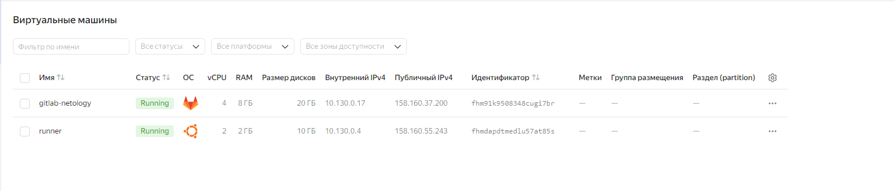

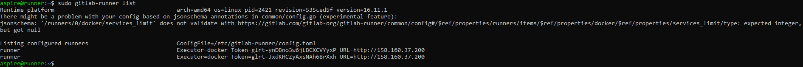


3. (* Необязательное задание повышенной сложности. )  Если вы уже знакомы с k8s попробуйте выполнить задание, запустив gitlab server и gitlab runner в k8s  [по инструкции](https://cloud.yandex.ru/docs/tutorials/infrastructure-management/gitlab-containers). 

4. Создайте свой новый проект.

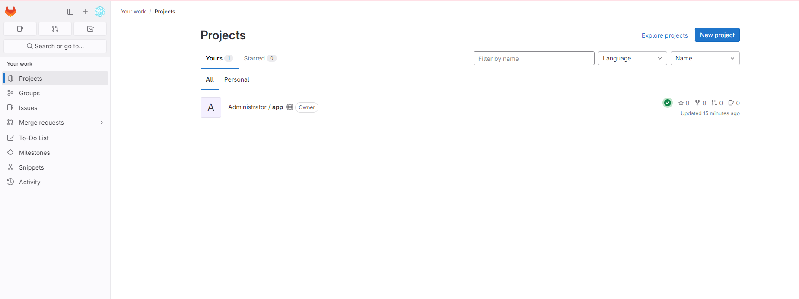

5. Создайте новый репозиторий в GitLab, наполните его [файлами](./repository).
6. Проект должен быть публичным, остальные настройки по желанию.

## Основная часть

### DevOps

В репозитории содержится код проекта на Python. Проект — RESTful API сервис. Ваша задача — автоматизировать сборку образа с выполнением python-скрипта:

1. Образ собирается на основе [centos:7](https://hub.docker.com/_/centos?tab=tags&page=1&ordering=last_updated).
2. Python версии не ниже 3.7.
3. Установлены зависимости: `flask` `flask-jsonpify` `flask-restful`.
4. Создана директория `/python_api`.
5. Скрипт из репозитория размещён в /python_api.
6. Точка вызова: запуск скрипта.
7. При комите в любую ветку должен собираться docker image с форматом имени hello:gitlab-$CI_COMMIT_SHORT_SHA . Образ должен быть выложен в Gitlab registry или yandex registry.   

Добавил  в репозиторий [Dockerfile](./repository/Dockerfile)  для  сборки  образа  и   файл [requirements.txt](./repository/requirements.txt) с зависимостями для  Flask. Образ выкладывается  на  YC, все переменные для подключения  к реестру Яндекса внесены в переменные  проекта.

### Product Owner

Вашему проекту нужна бизнесовая доработка: нужно поменять JSON ответа на вызов метода GET `/rest/api/get_info`, необходимо создать Issue в котором указать:

1. Какой метод необходимо исправить.
2. Текст с `{ "message": "Already started" }` на `{ "message": "Running"}`.
3. Issue поставить label: feature.

Создал новый Issue c необходимымми полями

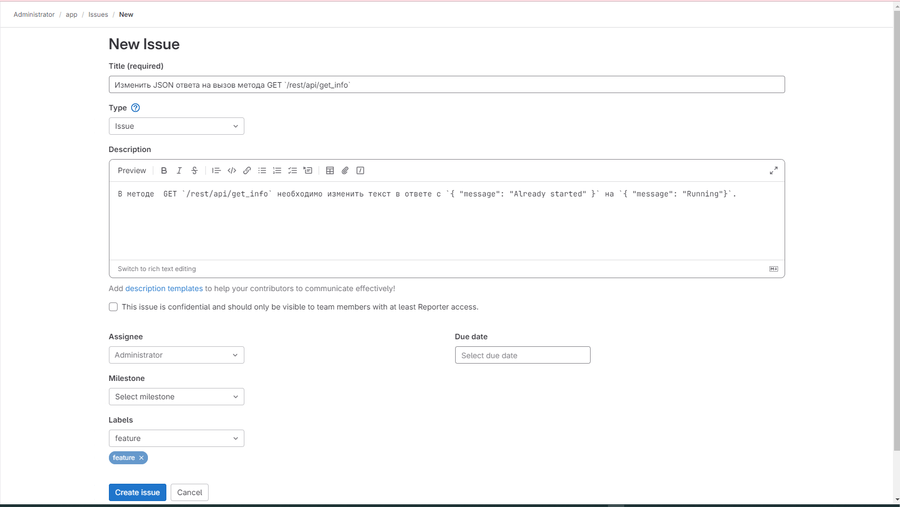

### Developer

Пришёл новый Issue на доработку, вам нужно:

1. Создать отдельную ветку, связанную с этим Issue.

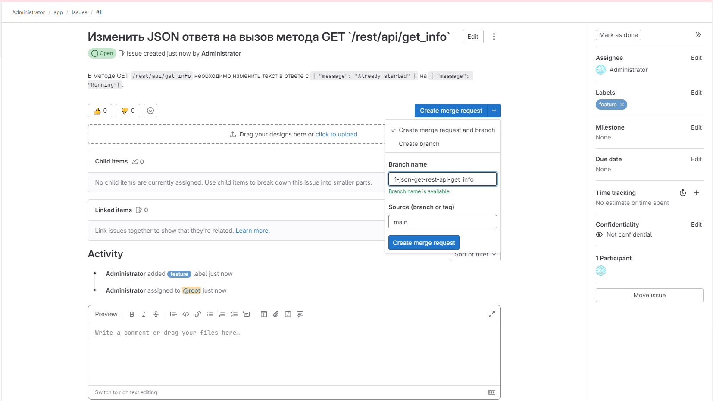

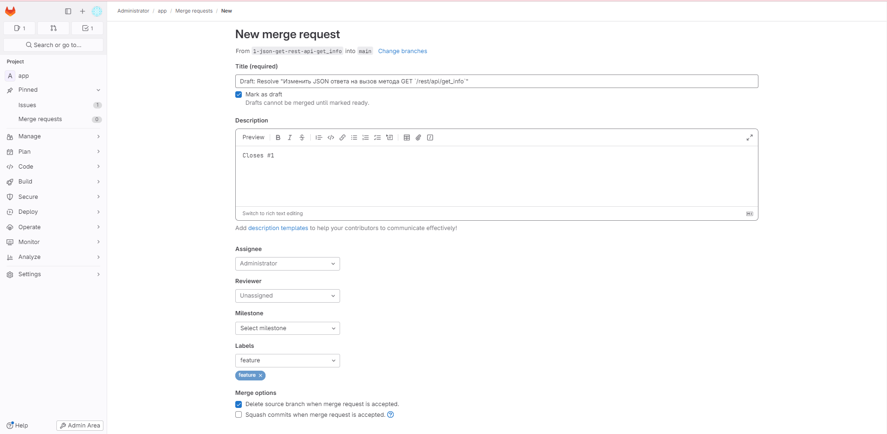

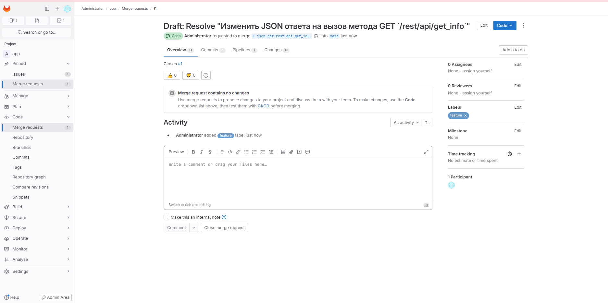


2. Внести изменения по тексту из задания.

<details>
    <summary>python-api.py</summary>

```python
from flask import Flask, request
from flask_restful import Resource, Api
from json import dumps
from flask_jsonpify import jsonify

app = Flask(__name__)
api = Api(app)

class Info(Resource):
    def get(self):
        return {'version': 3, 'method': 'GET', 'message': 'Running'}

api.add_resource(Info, '/get_info')

if __name__ == '__main__':
     app.run(host='0.0.0.0', port='5290')

```
</details>

Сборка образа прошла без  ошибок

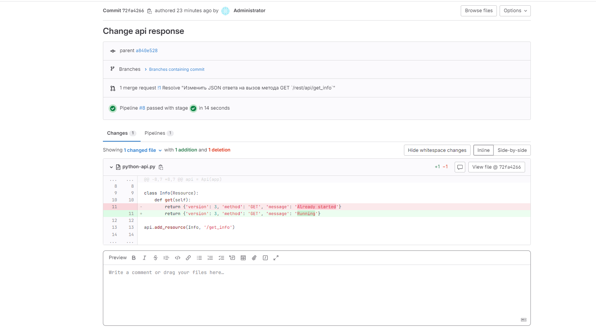

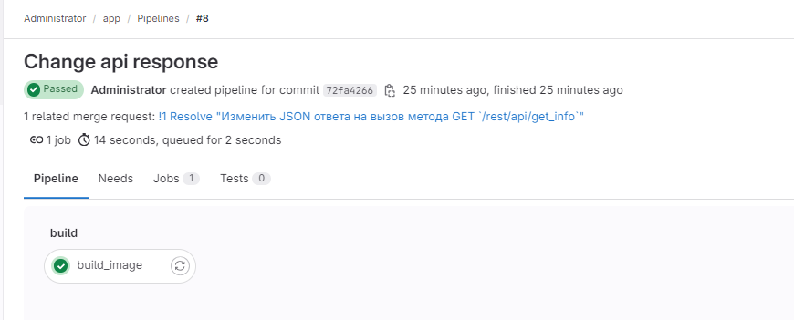


3. Подготовить Merge Request, влить необходимые изменения в `master`, проверить, что сборка прошла успешно.

Изменения влиты в `master`. Сборка и отправка образа в Registry  прошла успешно

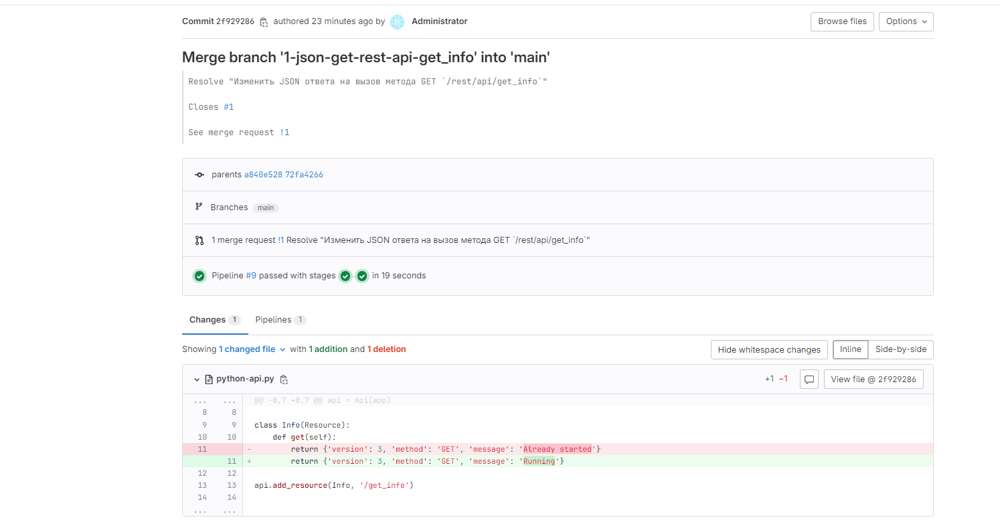

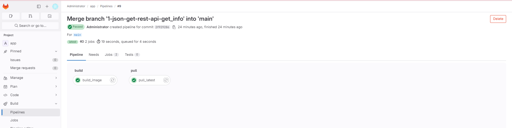


### Tester

Разработчики выполнили новый Issue, необходимо проверить валидность изменений:

1. Поднять докер-контейнер с образом `python-api:latest` и проверить возврат метода на корректность.

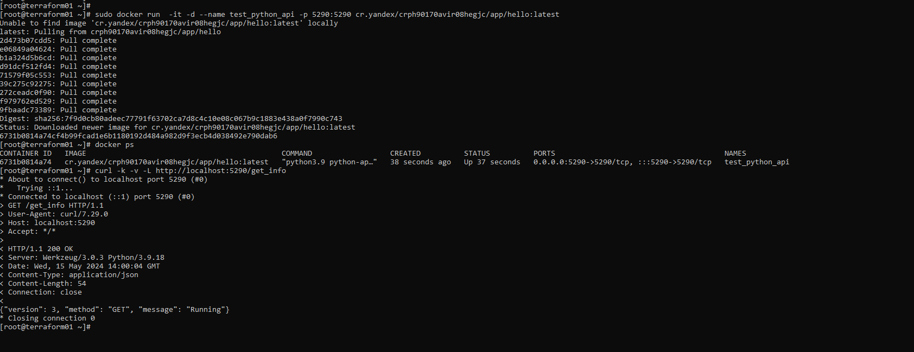

2. Закрыть Issue с комментарием об успешности прохождения, указав желаемый результат и фактически достигнутый.

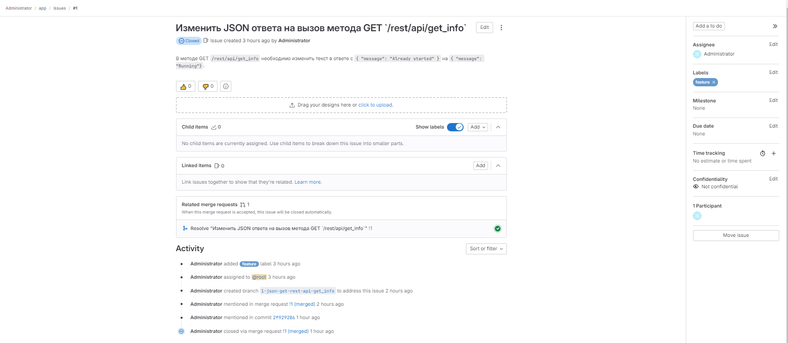


## Итог

В качестве ответа пришлите подробные скриншоты по каждому пункту задания:

- файл gitlab-ci.yml;
- Dockerfile; 
- лог успешного выполнения пайплайна;
- решённый Issue.

### Важно 
После выполнения задания выключите и удалите все задействованные ресурсы в Yandex Cloud.

