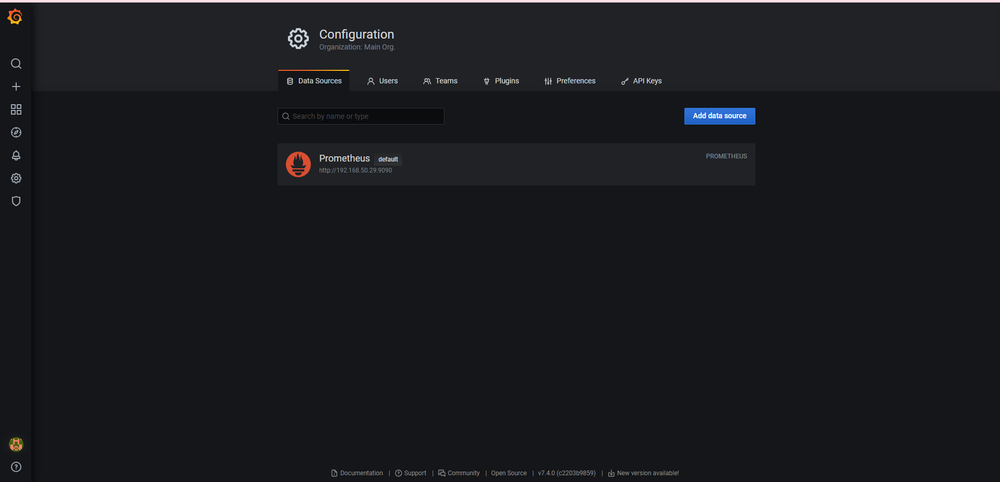
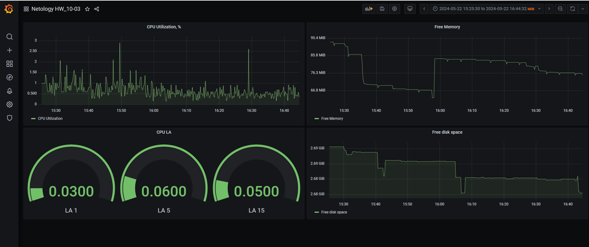
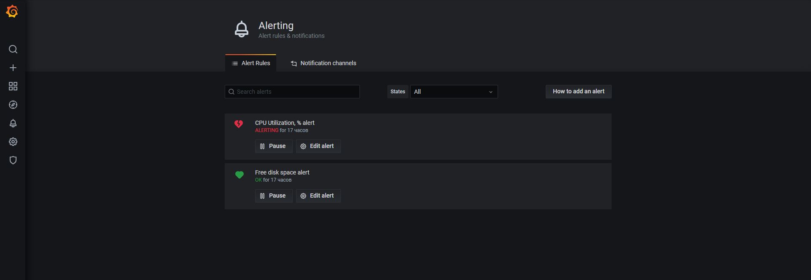
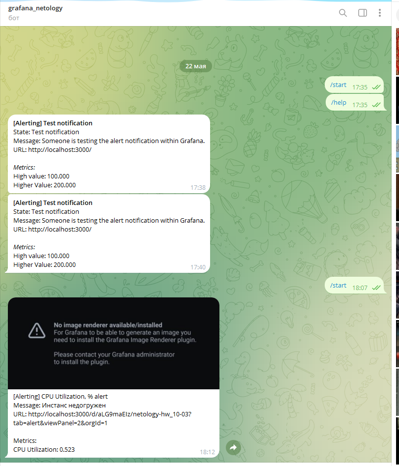
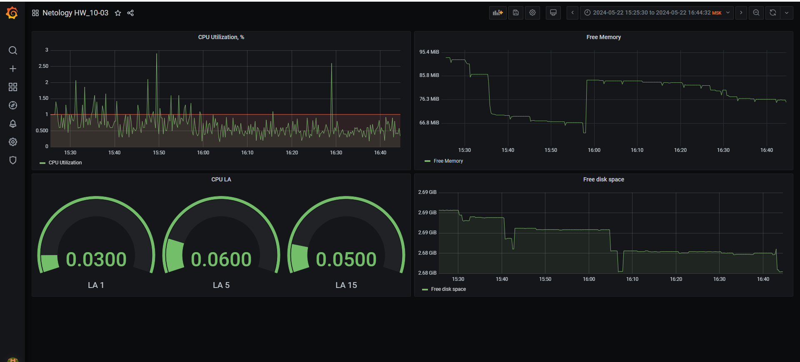

# Домашнее задание к занятию 14 «Средство визуализации Grafana»

## Задание повышенной сложности

**При решении задания 1** не используйте директорию [help](./help) для сборки проекта. Самостоятельно разверните grafana, где в роли источника данных будет выступать prometheus, а сборщиком данных будет node-exporter:

- grafana;
- prometheus-server;
- prometheus node-exporter.

За дополнительными материалами можете обратиться в официальную документацию grafana и prometheus.

В решении к домашнему заданию также приведите все конфигурации, скрипты, манифесты, которые вы 
использовали в процессе решения задания.

**При решении задания 3** вы должны самостоятельно завести удобный для вас канал нотификации, например, Telegram или email, и отправить туда тестовые события.

В решении приведите скриншоты тестовых событий из каналов нотификаций.

## Обязательные задания

### Задание 1

1. Используя директорию [help](./help) внутри этого домашнего задания, запустите связку prometheus-grafana.
1. Зайдите в веб-интерфейс grafana, используя авторизационные данные, указанные в манифесте docker-compose.
1. Подключите поднятый вами prometheus, как источник данных.
1. Решение домашнего задания — скриншот веб-интерфейса grafana со списком подключенных Datasource.



## Задание 2

Изучите самостоятельно ресурсы:

1. [PromQL tutorial for beginners and humans](https://valyala.medium.com/promql-tutorial-for-beginners-9ab455142085).
1. [Understanding Machine CPU usage](https://www.robustperception.io/understanding-machine-cpu-usage).
1. [Introduction to PromQL, the Prometheus query language](https://grafana.com/blog/2020/02/04/introduction-to-promql-the-prometheus-query-language/).

Создайте Dashboard и в ней создайте Panels:

- утилизация CPU для nodeexporter (в процентах, 100-idle);
- CPULA 1/5/15;
- количество свободной оперативной памяти;
- количество места на файловой системе.

Для решения этого задания приведите promql-запросы для выдачи этих метрик, а также скриншот получившейся Dashboard.



## Задание 3

1. Создайте для каждой Dashboard подходящее правило alert — можно обратиться к первой лекции в блоке «Мониторинг».
1. В качестве решения задания приведите скриншот вашей итоговой Dashboard.







## Задание 4

1. Сохраните ваш Dashboard.Для этого перейдите в настройки Dashboard, выберите в боковом меню «JSON MODEL». Далее скопируйте отображаемое json-содержимое в отдельный файл и сохраните его.
1. В качестве решения задания приведите листинг этого файла.

<details>
    <summary>dashboard.json</summary>

```json
{
    "annotations": {
      "list": [
        {
          "builtIn": 1,
          "datasource": "Prometheus",
          "enable": true,
          "hide": true,
          "iconColor": "rgba(0, 211, 255, 1)",
          "limit": 100,
          "name": "Annotations & Alerts",
          "showIn": 0,
          "type": "dashboard"
        }
      ]
    },
    "editable": true,
    "gnetId": null,
    "graphTooltip": 0,
    "id": 4,
    "links": [],
    "panels": [
      {
        "alert": {
          "alertRuleTags": {},
          "conditions": [
            {
              "evaluator": {
                "params": [
                  1
                ],
                "type": "lt"
              },
              "operator": {
                "type": "and"
              },
              "query": {
                "params": [
                  "B",
                  "5m",
                  "now"
                ]
              },
              "reducer": {
                "params": [],
                "type": "avg"
              },
              "type": "query"
            }
          ],
          "executionErrorState": "alerting",
          "for": "5m",
          "frequency": "1m",
          "handler": 1,
          "message": "Инстанс недогружен",
          "name": "CPU Utilization, % alert",
          "noDataState": "no_data",
          "notifications": []
        },
        "aliasColors": {},
        "bars": false,
        "dashLength": 10,
        "dashes": false,
        "datasource": null,
        "fieldConfig": {
          "defaults": {
            "color": {},
            "custom": {},
            "thresholds": {
              "mode": "absolute",
              "steps": []
            },
            "unit": "short"
          },
          "overrides": []
        },
        "fill": 1,
        "fillGradient": 0,
        "gridPos": {
          "h": 9,
          "w": 12,
          "x": 0,
          "y": 0
        },
        "hiddenSeries": false,
        "id": 2,
        "legend": {
          "avg": false,
          "current": false,
          "max": false,
          "min": false,
          "show": true,
          "total": false,
          "values": false
        },
        "lines": true,
        "linewidth": 1,
        "nullPointMode": "null",
        "options": {
          "alertThreshold": true
        },
        "percentage": false,
        "pluginVersion": "7.4.0",
        "pointradius": 2,
        "points": false,
        "renderer": "flot",
        "seriesOverrides": [],
        "spaceLength": 10,
        "stack": false,
        "steppedLine": false,
        "targets": [
          {
            "expr": "100 - (avg (irate(node_cpu_seconds_total{mode=\"idle\"}[5m]) * 100))",
            "format": "time_series",
            "hide": false,
            "interval": "",
            "intervalFactor": 1,
            "legendFormat": "CPU Utilization",
            "refId": "B"
          }
        ],
        "thresholds": [
          {
            "colorMode": "critical",
            "fill": true,
            "line": true,
            "op": "lt",
            "value": 1,
            "visible": true
          }
        ],
        "timeFrom": null,
        "timeRegions": [],
        "timeShift": null,
        "title": "CPU Utilization, %",
        "tooltip": {
          "shared": true,
          "sort": 0,
          "value_type": "individual"
        },
        "type": "graph",
        "xaxis": {
          "buckets": null,
          "mode": "time",
          "name": null,
          "show": true,
          "values": []
        },
        "yaxes": [
          {
            "format": "short",
            "label": null,
            "logBase": 1,
            "max": null,
            "min": null,
            "show": true
          },
          {
            "format": "short",
            "label": null,
            "logBase": 1,
            "max": null,
            "min": null,
            "show": true
          }
        ],
        "yaxis": {
          "align": false,
          "alignLevel": null
        }
      },
      {
        "datasource": null,
        "description": "",
        "fieldConfig": {
          "defaults": {
            "color": {
              "mode": "palette-classic"
            },
            "custom": {
              "axisLabel": "",
              "axisPlacement": "left",
              "barAlignment": 0,
              "drawStyle": "line",
              "fillOpacity": 0,
              "gradientMode": "none",
              "hideFrom": {
                "graph": false,
                "legend": false,
                "tooltip": false
              },
              "lineInterpolation": "linear",
              "lineWidth": 1,
              "pointSize": 5,
              "scaleDistribution": {
                "type": "linear"
              },
              "showPoints": "auto",
              "spanNulls": false
            },
            "mappings": [],
            "thresholds": {
              "mode": "absolute",
              "steps": [
                {
                  "color": "green",
                  "value": null
                },
                {
                  "color": "red",
                  "value": 80
                }
              ]
            },
            "unit": "bytes"
          },
          "overrides": []
        },
        "gridPos": {
          "h": 9,
          "w": 12,
          "x": 12,
          "y": 0
        },
        "id": 6,
        "options": {
          "legend": {
            "calcs": [],
            "displayMode": "list",
            "placement": "bottom"
          },
          "tooltipOptions": {
            "mode": "single"
          }
        },
        "pluginVersion": "7.4.0",
        "targets": [
          {
            "expr": "node_memory_MemFree_bytes{job=\"nodeexporter\"}",
            "instant": false,
            "interval": "",
            "legendFormat": "Free Memory",
            "refId": "A"
          }
        ],
        "title": "Free Memory",
        "type": "timeseries"
      },
      {
        "datasource": null,
        "fieldConfig": {
          "defaults": {
            "color": {
              "mode": "thresholds"
            },
            "custom": {},
            "mappings": [],
            "thresholds": {
              "mode": "absolute",
              "steps": [
                {
                  "color": "green",
                  "value": null
                },
                {
                  "color": "red",
                  "value": 80
                }
              ]
            }
          },
          "overrides": []
        },
        "gridPos": {
          "h": 8,
          "w": 12,
          "x": 0,
          "y": 9
        },
        "id": 4,
        "options": {
          "reduceOptions": {
            "calcs": [
              "lastNotNull"
            ],
            "fields": "",
            "values": false
          },
          "showThresholdLabels": false,
          "showThresholdMarkers": true,
          "text": {}
        },
        "pluginVersion": "7.4.0",
        "targets": [
          {
            "expr": "node_load1{job=\"nodeexporter\"}",
            "interval": "",
            "legendFormat": "LA 1",
            "refId": "A"
          },
          {
            "expr": "node_load5{job=\"nodeexporter\"}",
            "hide": false,
            "interval": "",
            "legendFormat": "LA 5",
            "refId": "B"
          },
          {
            "expr": "node_load15{job=\"nodeexporter\"}",
            "format": "time_series",
            "hide": false,
            "interval": "",
            "legendFormat": "LA 15",
            "refId": "C"
          }
        ],
        "title": "CPU  LA",
        "type": "gauge"
      },
      {
        "alert": {
          "alertRuleTags": {},
          "conditions": [
            {
              "evaluator": {
                "params": [
                  3
                ],
                "type": "lt"
              },
              "operator": {
                "type": "and"
              },
              "query": {
                "params": [
                  "A",
                  "1m",
                  "now"
                ]
              },
              "reducer": {
                "params": [],
                "type": "last"
              },
              "type": "query"
            }
          ],
          "executionErrorState": "alerting",
          "for": "5m",
          "frequency": "1m",
          "handler": 1,
          "message": "The free space in the catalog is running out /  on nodeexporter",
          "name": "Free disk space alert",
          "noDataState": "no_data",
          "notifications": [
            {
              "uid": "FJcRM-ESz"
            }
          ]
        },
        "aliasColors": {},
        "bars": false,
        "dashLength": 10,
        "dashes": false,
        "datasource": null,
        "fieldConfig": {
          "defaults": {
            "color": {},
            "custom": {},
            "thresholds": {
              "mode": "absolute",
              "steps": []
            },
            "unit": "bytes"
          },
          "overrides": []
        },
        "fill": 1,
        "fillGradient": 0,
        "gridPos": {
          "h": 8,
          "w": 12,
          "x": 12,
          "y": 9
        },
        "hiddenSeries": false,
        "id": 8,
        "legend": {
          "avg": false,
          "current": false,
          "max": false,
          "min": false,
          "show": true,
          "total": false,
          "values": false
        },
        "lines": true,
        "linewidth": 1,
        "nullPointMode": "null",
        "options": {
          "alertThreshold": true
        },
        "percentage": false,
        "pluginVersion": "7.4.0",
        "pointradius": 2,
        "points": false,
        "renderer": "flot",
        "seriesOverrides": [],
        "spaceLength": 10,
        "stack": false,
        "steppedLine": false,
        "targets": [
          {
            "expr": "node_filesystem_avail_bytes{device=\"/dev/mapper/centos-root\", fstype=\"xfs\", instance=\"nodeexporter:9100\", job=\"nodeexporter\", mountpoint=\"/\"}",
            "interval": "",
            "legendFormat": "Free disk space",
            "refId": "A"
          }
        ],
        "thresholds": [
          {
            "colorMode": "critical",
            "fill": true,
            "line": true,
            "op": "lt",
            "value": 3,
            "visible": true
          }
        ],
        "timeFrom": null,
        "timeRegions": [],
        "timeShift": null,
        "title": "Free disk space",
        "tooltip": {
          "shared": true,
          "sort": 0,
          "value_type": "individual"
        },
        "type": "graph",
        "xaxis": {
          "buckets": null,
          "mode": "time",
          "name": null,
          "show": true,
          "values": []
        },
        "yaxes": [
          {
            "format": "bytes",
            "label": null,
            "logBase": 1,
            "max": null,
            "min": null,
            "show": true
          },
          {
            "format": "short",
            "label": null,
            "logBase": 1,
            "max": null,
            "min": null,
            "show": true
          }
        ],
        "yaxis": {
          "align": false,
          "alignLevel": null
        }
      }
    ],
    "refresh": false,
    "schemaVersion": 27,
    "style": "dark",
    "tags": [],
    "templating": {
      "list": []
    },
    "time": {
      "from": "2024-05-22T12:25:30.569Z",
      "to": "2024-05-22T13:44:32.697Z"
    },
    "timepicker": {},
    "timezone": "Europe/Moscow",
    "title": "Netology HW_10-03",
    "uid": "aLG9maEIz",
    "version": 6
  }
```
</details>


---

### Как оформить решение задания

Выполненное домашнее задание пришлите в виде ссылки на .md-файл в вашем репозитории.

---
